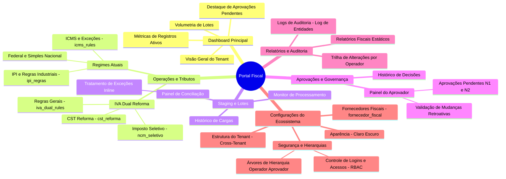

# 1. IDEIAS PARA FRONTEND

Para criar um portal de cadastro de impostos organizacionais moderno e seguro, a melhor abordagem de frontend é utilizar um layout baseado em Dashboard Admin com Menu Lateral (Sidebar Navigation) estruturado em módulos. Como o sistema lida com alta densidade de dados fiscais (ICMS, ISS, PIS, COFINS, IBS, CBS, IS) e conformidade estrita (logs, Keycloak), a interface precisa priorizar clareza, tabelas robustas e fluxos de aprovação visíveis.

Abaixo estão as principais ideias e estruturas de design para o seu frontend:

## 💼 Arquitetura de Telas e Módulos Principais

* 
* Painel Central (Dashboard de Alterações): Exiba cartões com o resumo de cadastros ativos, alterações pendentes de aprovação e gráficos de linha com a evolução das atualizações tributárias.
* Módulo Fiscal (Cadastro de Impostos): Utilize uma interface de abas (Tabs) para separar os impostos federais/estaduais tradicionais (ICMS, ISS, PIS, COFINS) da nova estrutura da Reforma Tributária (IBS, CBS, Imposto Seletivo - IS).
* Auditoria e Logs: Tabela densa com filtros avançados por data, usuário, tipo de ação (Inserção, Alteração, Exclusão) e a possibilidade de expandir a linha para ver o "Antes" e "Depois" dos dados.
* Relatórios de KPI: Gráficos de pizza para distribuição de carga tributária por filial e indicadores de tempo médio de aprovação de cadastros.
* 

## 🎨 Layout, Componentes e Usabilidade

```bash
+-------------------------------------------------------------------------+

| [≡] Portal Fiscal Organizacional               [Sino Notificação] (User) |
+-------------------------------------------------------------------------+

| (•) Dashboard      |  Filtros: [ Empresa ] [ Período ] [ Tipo Imposto ] |
|                    |                                                    |
| ($) Impostos       |  +-------------------+  +------------------------+  |
|    - Estaduais/Mun |  | KPI: Pendentes    |  | Gráfico: Alterações    |  |
|    - IBS / CBS / IS|  |    14 Cadastros   |  | (Linha do tempo)       |  |
|                    |  +-------------------+  +------------------------+  |
| (📋) Auditoria/Log |                                                    |
|                    |  Tabela de Cadastros Recentes                      |
| (📊) Relatórios KPI|  +----------------------------------------------+  |
|                    |  | Imposto | Alíquota | Estado | Status  | Ação |  |
| (⚙️) Configurações  |  +----------------------------------------------+  |
+--------------------+----------------------------------------------------+
```


* 
* Formulários de Impostos (Wizard Steps): Cadastrar regras fiscais é complexo. Use formulários divididos em passos (ex: 1. Dados Gerais, 2. Alíquotas e Exceções, 3. Vigência Fiscal).
* Diferenciação Visual (Diff Viewer): No dashboard de alterações e logs, use blocos de texto coloridos (fundo verde para dados adicionados, fundo vermelho para dados antigos removidos) para que o auditor veja o que mudou instantaneamente.
* Status Tags Claros: Badge system para controle de fluxo (ex: Verde para Homologado, Amarelo para Aguardando Aprovação, Vermelho para Rejeitado).
* 

## 🔐 Integração Keycloak e Controle de Acesso (RBAC)

* 
* Tela de Login Customizada: O Keycloak permite estilizar a tela de login nativa. Desenhe um tema limpo com a identidade visual da sua organização, incluindo campos de Login, Senha e suporte a múltiplos fatores de autenticação (MFA).
* Visibilidade Baseada em Roles (Papéis):
* Role Fiscal_Operator: Visualiza o menu de impostos e cria rascunhos de alteração.
   * Role Fiscal_Approver: Visualiza o Dashboard de Alterações com botões de "Aprovar" ou "Rejeitar".
   * Role Auditor: Tem acesso exclusivo ou destacado ao menu de Auditoria, Logs e Relatórios de KPI, com os formulários de cadastro em modo "Apenas Leitura".
* Tratamento de Sessão Visual: Adicione um aviso discreto no topo da tela quando o token estiver próximo de expirar (ex: "Sua sessão expira em 5 minutos"), permitindo que o usuário renove sem perder dados do formulário fiscal.
* 

## 🛠️ Tecnologias de Frontend Recomendadas

* 
* Framework Base: React, Vue.js (v3) ou Angular (pela facilidade de componentização de tabelas e gerenciamento de estado complexo).
* Biblioteca de UI: Tailwind CSS (para design sob medida rápido), Ant Design ou shadcn/ui (excelentes para sistemas corporativos densos, pois já possuem tabelas e filtros avançados nativos).
* Biblioteca de Gráficos (KPIs): Recharts ou Chart.js pela renderização limpa e responsiva de gráficos de linha e barras.
* Biblioteca Keycloak: keycloak-js integrada com o estado global do app (como Context API ou Pinia) para bloquear rotas diretamente no client-side antes de renderizar páginas proibidas.
* 

---

# 2 - MAIS IDEIAS

O uso de shadcn/ui (baseado em Tailwind e Radix UI) encaixa-se perfeitamente aqui para criar os componentes corporativos necessários.
Estrutura de frontend desenhada especificamente para o seu cenário de dupla experiência (Dashboard Minimalista vs. Operacional de Alta Densidade) e o fluxo complexo de múltiplas alçadas.

------------------------------
## 🏛️ Estrutura de Telas e Fluxos

## 1. Home / Dashboard Principal (Espaçado e Minimalista)
Esta tela serve para o gestor ou operador iniciar o dia com clareza, sem poluição visual. Use bastante espaço em branco (gap-8, p-8), fontes elegantes e cartões limpos.

* Linha de KPIs (Métricas Globais): 3 ou 4 cartões grandes com cantos arredondados (rounded-xl), fundo branco ou cinza bem claro, exibindo apenas um número grande e uma etiqueta discreta:
* Total de Impostos Cadastrados
   * Processos Aguardando Minha Aprovação
   * Cargas em Lote em Andamento
* Seção de Processos em Aprovação (Foco em Alçadas): Uma lista limpa mostrando o progresso das aprovações. Em vez de uma tabela cheia de linhas, use um layout de cards onde cada processo mostra uma mini "Linha do Tempo de Alçadas":
* Exemplo: [Operador] ➔ [Gerente Fiscal (Aprovado)] ➔ [Diretor (Pendente)] com bolinhas verdes e cinzas.
* Últimas Mudanças: Um feed de atividades minimalista (estilo timeline vertical fina) mostrando: "Há 10 min - João alterou alíquota de IBS da Filial SP".

## 2. Telas de Gestão de Impostos (Alta Densidade / Estilo Planilha)
Aqui o design muda para foco operacional máximo. Reduza o espaçamento (p-2, py-1 nas linhas), use fontes mono-espaçadas para números (font-mono) e grades bem definidas.

* Layout Data-Grid: Utilize o pacote @tanstack/react-table (que é a base do shadcn). Ele permite criar tabelas com:
* Filtros fixos no topo de cada coluna (input embutido na própria célula de cabeçalho).
   * Rolagem infinita ou paginação compacta no rodapé.
   * Congelamento de colunas (ex: manter a coluna "Imposto" e "Filial" fixas à esquerda enquanto rola as alíquotas).
* Modo de Edição Inline: Permita que o usuário clique duas vezes em uma célula para editar a alíquota ou vigência diretamente na tabela (estilo Excel), gerando um rascunho.
* Abas de Divisão: Uma barra de abas compacta no topo para alternar instantaneamente entre ICMS, ISS, PIS/COFINS e a nova cesta IBS / CBS / IS.

------------------------------
## 🪵 Componentes Chave para o Fluxo de Múltiplas Alçadas
Como as alterações manuais podem ter e as cargas em lote sempre terão múltiplas alçadas, o frontend precisa deixar claro o "status do fluxo".

## Componente: ApprovalStepper (Indicador de Alçadas)
Exiba este componente nos detalhes de qualquer mudança pendente ou lote enviado:

```javascript
// Exemplo conceitual com Tailwind para a linha do tempo de aprovaçãoexport function ApprovalStepper({ steps }) {
  return (
    <div className="flex items-center space-x-4 p-4 bg-slate-50 rounded-lg">
      {steps.map((step, index) => (
        <div key={index} className="flex items-center space-x-2">
          <div className={`w-6 h-6 rounded-full flex items-center justify-center text-xs font-bold 
            ${step.status === 'approved' ? 'bg-green-600 text-white' : 
              step.status === 'current' ? 'bg-blue-600 text-white animate-pulse' : 'bg-gray-200 text-gray-600'}`}>
            {index + 1}
          </div>
          <span className={`text-sm font-medium ${step.status === 'current' ? 'text-blue-700 font-semibold' : 'text-gray-500'}`}>
            {step.roleName}
          </span>
          {index < steps.length - 1 && <span className="text-gray-300">➔</span>}
        </div>
      ))}
    </div>
  )
}
```

## Componente: BatchUploadZone (Carga em Lote)

* Área de Drag and Drop minimalista para arquivos (CSV/XML).
* Modal de Validação Prévia: Antes de enviar para aprovação, exiba uma pré-visualização das linhas da planilha em uma tabela densa sinalizando erros em vermelho (ex: "CNPJ inválido" ou "Alíquota IBS acima do teto").
* Aviso de Alçada Forçada: Um banner informativo discreto: "Este processo de carga em lote requer aprovação de 3 alçadas (Gerência, Controladoria e Diretoria)."

------------------------------
## 🎨 Sugestão de Arquitetura de Pastas (Vite + React)

Para manter a organização entre as telas minimalistas e as telas densas:

```bash
src/
├── components/
│   ├── ui/               # Componentes base do shadcn (Button, Table, Dialog)
│   ├── ApprovalStepper.tsx
│   ├── DiffViewer.tsx    # Compara dados antigos vs novos antes de aprovar
│   └── MetricCard.tsx    # Os cards minimalistas da Home
├── hooks/
│   └── useKeycloak.ts    # Hook customizado para obter as Roles do usuário
├── pages/
│   ├── Dashboard/        # Layout Espaçado e Minimalista
│   │   └── index.tsx
│   ├── Management/       # Layout de Alta Densidade (Estilo Planilha)
│   │   ├── ImpostosTradicionais.tsx
│   │   └── ReformaTributaria.tsx (IBS, CBS, IS)
│   └── Audit/            # Logs e Auditoria
└── routes/
    └── PrivateRoute.tsx  # Proteção de rotas baseada nas Roles do Keycloak
```

## 🔒 Dica de Integração com o Keycloak (RBAC)
Para controlar as alçadas no frontend, configure o client do Keycloak para injetar as permissões no token (ex: realm_access.roles). No seu código React, você pode criar uma condicional simples para renderizar as ações da alçada atual:

```javascript
const { hasRole } = useAuth();
// Na tela de detalhes da mudança:
{hasRole('FISCAL_DIRECTOR') && currentStep === 3 && (
  <div className="flex gap-2">
    <Button className="bg-green-600">Aprovar Alçada Final</Button>
    <Button variant="destructive">Rejeitar e Devolver</Button>
  </div>
)}
```

<div className="flex gap-2">
  <Button className="bg-green-600">Aprovar Alçada Final</Button>
  <Button variant="destructive">Rejeitar e Devolver</Button>
</div>

Para avançarmos no design desse portal, você gostaria de ver uma proposta de design de cores (Ex: Dark Mode corporativo ou Light clean)? Ou prefere focar em um exemplo de código de como estruturar a tabela densa com filtros avançados?

---

# 3. Dualidade de telas 

- a Home minimalista 
- e as páginas operacionais densas)
- a escolha da paleta é crucial para evitar a fadiga visual nas tabelas, mantendo a elegância nos dashboards.

------------------------------
## ☀️ Opção 1: Light Clean (Foco em Clareza e Foco)
Ideal para ambientes de escritório bem iluminados. Esta paleta usa tons de cinza azulados (Slate/Zinc) para reduzir o contraste agressivo do branco puro, transmitindo uma sensação de software moderno e institucional.
## 🎨 Paleta de Cores (Tailwind)

* Fundo Principal (Background): bg-slate-50 (#F8FAFC) - Descanso para os olhos.
* Fundo de Elementos (Cards/Tabelas): bg-white (#FFFFFF) - Destaca os módulos da tela.
* Texto Principal: text-slate-900 (#0F172A) - Alta legibilidade.
* Texto Secundário/Muted: text-slate-500 (#64748B) - Para labels e detalhes menos importantes.
* Bordas e Divisores: border-slate-200 (#E2E8F0) - Linhas finas para a grade estilo planilha.

## 🎯 Cores de Destaque (Ações e Status)

* Cor Primária (Botões/Links): bg-indigo-600 (#4F46E5) ou bg-blue-600. Traz sobriedade e tecnologia.
* Status: Mudança Aprovada / Concluída: bg-emerald-50 text-emerald-700 border-emerald-200
* Status: Aguardando Minha Alçada: bg-amber-50 text-amber-700 border-amber-200
* Status: Erro na Carga em Lote / Rejeitado: bg-rose-50 text-rose-700 border-rose-200

------------------------------
## 🌙 Opção 2: Dark Mode Corporativo (Foco em Alta Densidade)
O modo escuro é altamente recomendado para a equipe operacional que passa horas analisando as planilhas de IBS, CBS e ICMS, pois reduz drasticamente o cansaço visual. Evitamos o preto puro (#000) para não gerar um contraste "neon" desconfortável.
## 🎨 Paleta de Cores (Tailwind)

* Fundo Principal (Background): bg-zinc-950 (#09090B) ou bg-slate-950 (#020617).
* Fundo de Elementos (Cards/Tabelas): bg-zinc-900 (#18181B) ou bg-slate-900 (#0F172A).
* Texto Principal: text-zinc-50 (#FAFAFA) - Branco suave, não agride os olhos.
* Texto Secundário/Muted: text-zinc-400 (#A1A1AA) - Para cabeçalhos de tabelas e logs.
* Bordas e Divisores: border-zinc-800 (#27272A) - Essencial para delimitar as células da planilha sem poluir.

## 🎯 Cores de Destaque (Ações e Status no Dark)

* Cor Primária (Botões/Links): bg-sky-500 hover:bg-sky-600 (#0EA5E9). Tons de azul claro/ciano funcionam melhor sobre fundos escuros.
* Status: Mudança Aprovada: bg-emerald-950/50 text-emerald-400 border-emerald-800/60
* Status: Aguardando Minha Alçada: bg-amber-950/50 text-amber-400 border-amber-800/60
* Status: Erro / Rejeitado: bg-rose-950/50 text-rose-400 border-rose-800/60

------------------------------
## 🛠️ Como aplicar a transição e a dualidade no React
Como o Tailwind possui suporte nativo ao Dark Mode (usando a classe dark:), você pode configurar as duas opções e permitir que o usuário mude ou o sistema siga o padrão do sistema operacional.
Aqui está um exemplo prático de aplicação para as suas duas experiências de tela:
## 1. Na Home Minimalista (Exemplo de Card com Tailwind)

```javascript
// Card espaçado, limpo e com sombras suaves que mudam no Dark Modeexport function DashboardMetricCard({ title, value }) {
  return (
    <div className="p-6 rounded-xl border transition-all
      bg-white text-slate-900 border-slate-200 shadow-sm
      dark:bg-zinc-900 dark:text-zinc-50 dark:border-zinc-800">
      <p className="text-sm font-medium text-slate-500 dark:text-zinc-400">{title}</p>
      <p className="text-3xl font-semibold mt-2 tracking-tight">{value}</p>
    </div>
  )
}
```

## 2. Na Tabela Densa de Impostos (Exemplo de Célula Estilo Planilha)

```javascript
// Células compactas, fontes mono-espaçadas e bordas nítidas para dados fiscaisexport function TableCellData({ value }) {
  return (
    <td className="px-2 py-1 text-xs font-mono border-r last:border-r-0
      border-slate-200 text-slate-800 bg-white
      dark:border-zinc-800 dark:text-zinc-200 dark:bg-zinc-900">
      {value}
    </td>
  )
}
```

## 💡 Recomendação
Comece implementando o Light Clean como padrão, mas utilize as classes semânticas do Tailwind ou variáveis CSS (--background, --foreground) se for usar o shadcn/ui. Isso garantirá que, se a diretoria ou o time operacional exigir o Dark Mode no futuro para a análise das planilhas de carga em lote, a virada de chave exigirá zero refatoração de código.

---

# 4. Uma simples idéia de código completo e componentizado em React + Tailwind CSS para exibir uma linha de aprovação de múltiplas alçadas.

Este componente foi desenhado para se encaixar na sua Home Minimalista. Ele exibe o status de forma limpa, utiliza um stepper visual para mostrar por quais gerentes/diretores o processo já passou (ou está travado), e inclui as ações de aprovação que aparecem dinamicamente se o usuário logado for o responsável pela alçada atual (simulando a integração com o Keycloak).

## Componente: ApprovalTimelineRow.tsx

```javascript
import React from 'react';import { CheckCircle2, Clock, XCircle, AlertCircle, FileSpreadsheet, User } from 'lucide-react';
// 1. Definição dos Tipos de Dadosexport type StepStatus = 'approved' | 'pending' | 'rejected' | 'waiting';
export interface ApprovalStep {
  id: string;
  roleName: string;      // Nome do papel/cargo (ex: Gerente Fiscal)
  approverName?: string;  // Nome do usuário que aprovou (se houver)
  status: StepStatus;
  updatedAt?: string;    // Data/Hora da ação
}
export interface ProcessRequest {
  id: string;
  type: 'manual' | 'batch';
  title: string;          // Ex: "Alteração de Alíquota IBS - SP"
  description: string;    // Ex: "Carga de 1.450 itens via planilha" ou justificativa
  author: string;
  createdAt: string;
  steps: ApprovalStep[];
}
interface ApprovalTimelineRowProps {
  request: ProcessRequest;
  currentUserRole: string; // Ex: 'ROLE_DIRETOR_FINANCEIRO' (Vindo do Keycloak)
  onApprove: (requestId: string, stepId: string) => void;
  onReject: (requestId: string, stepId: string) => void;
}
export function ApprovalTimelineRow({
  request,
  currentUserRole,
  onApprove,
  onReject,
}: ApprovalTimelineRowProps) {
  
  // Encontra qual é a alçada que está aguardando ação no momento
  const currentActiveStep = request.steps.find((step) => step.status === 'pending');
  
  // Verifica se o usuário atual do Keycloak é quem deve aprovar esta alçada agora
  const isMyTurnToApprove = currentActiveStep && currentActiveStep.roleName === currentUserRole;

  return (
    <div className="p-6 bg-white dark:bg-zinc-900 border border-slate-200 dark:border-zinc-800 rounded-xl shadow-sm transition-all hover:shadow-md">
      
      {/* Topo do Card: Informações do Processo */}
      <div className="flex flex-col md:flex-row md:items-center justify-between gap-4 border-b border-slate-100 dark:border-zinc-800 pb-4 mb-5">
        <div className="flex items-start gap-3">
          <div className={`p-2.5 rounded-lg ${request.type === 'batch' ? 'bg-blue-50 text-blue-600 dark:bg-blue-950/40 dark:text-blue-400' : 'bg-indigo-50 text-indigo-600 dark:bg-indigo-950/40 dark:text-indigo-400'}`}>
            {request.type === 'batch' ? <FileSpreadsheet className="w-5 h-5" /> : <User className="w-5 h-5" />}
          </div>
          <div>
            <div className="flex items-center gap-2 flex-wrap">
              <h3 className="text-base font-semibold text-slate-900 dark:text-zinc-50">{request.title}</h3>
              <span className={`text-xs font-medium px-2 py-0.5 rounded-full ${
                request.type === 'batch' 
                  ? 'bg-blue-50 text-blue-700 dark:bg-blue-950/60 dark:text-blue-300 border border-blue-200 dark:border-blue-800' 
                  : 'bg-indigo-50 text-indigo-700 dark:bg-indigo-950/60 dark:text-indigo-300 border border-indigo-200 dark:border-indigo-800'
              }`}>
                {request.type === 'batch' ? 'Carga em Lote' : 'Ajuste Manual'}
              </span>
            </div>
            <p className="text-sm text-slate-500 dark:text-zinc-400 mt-0.5">{request.description}</p>
            <p className="text-xs text-slate-400 dark:text-zinc-500 mt-1">
              Enviado por <span className="font-medium">{request.author}</span> em {request.createdAt}
            </p>
          </div>
        </div>

        {/* Botões de Ação Condicionais (Baseados no Keycloak Role) */}
        {isMyTurnToApprove && (
          <div className="flex items-center gap-2 self-end md:self-center bg-slate-50 dark:bg-zinc-950 p-1.5 rounded-lg border border-slate-200/60 dark:border-zinc-800">
            <span className="text-xs font-medium text-amber-700 dark:text-amber-400 px-2 animate-pulse flex items-center gap-1">
              <AlertCircle className="w-3.5 h-3.5" /> Sua Alçada
            </span>
            <button
              onClick={() => onReject(request.id, currentActiveStep.id)}
              className="px-3 py-1.5 text-xs font-medium text-rose-600 hover:text-rose-700 hover:bg-rose-50 dark:hover:bg-rose-950/30 rounded-md transition-colors"
            >
              Rejeitar
            </button>
            <button
              onClick={() => onApprove(request.id, currentActiveStep.id)}
              className="px-3 py-1.5 text-xs font-medium text-white bg-emerald-600 hover:bg-emerald-700 rounded-md shadow-sm transition-colors"
            >
              Aprovar Alçada
            </button>
          </div>
        )}
      </div>

      {/* Fluxo de Alçadas (O Stepper Horizontal/Responsivo) */}
      <div className="grid grid-cols-1 sm:grid-cols-2 lg:flex lg:items-center lg:justify-between gap-4 lg:gap-2">
        {request.steps.map((step, index) => {
          const isApproved = step.status === 'approved';
          const isPending = step.status === 'pending';
          const isRejected = step.status === 'rejected';

          return (
            <div key={step.id} className="flex-1 flex items-center gap-3 relative group">
              {/* Ícone Indicador de Status */}
              <div className="flex-shrink-0">
                {isApproved && (
                  <div className="text-emerald-600 dark:text-emerald-400 bg-emerald-50 dark:bg-emerald-950/30 p-1 rounded-full">
                    <CheckCircle2 className="w-5 h-5" />
                  </div>
                )}
                {isPending && (
                  <div className="text-amber-600 dark:text-amber-400 bg-amber-50 dark:bg-amber-950/30 p-1 rounded-full animate-pulse border border-amber-300 dark:border-amber-700">
                    <Clock className="w-5 h-5" />
                  </div>
                )}
                {isRejected && (
                  <div className="text-rose-600 dark:text-rose-400 bg-rose-50 dark:bg-rose-950/30 p-1 rounded-full">
                    <XCircle className="w-5 h-5" />
                  </div>
                )}
                {step.status === 'waiting' && (
                  <div className="text-slate-300 dark:text-zinc-700 bg-slate-50 dark:bg-zinc-900 p-1 rounded-full border border-slate-200 dark:border-zinc-800">
                    <div className="w-5 h-5 rounded-full flex items-center justify-center text-[10px] font-bold">
                      {index + 1}
                    </div>
                  </div>
                )}
              </div>

              {/* Textos da Alçada */}
              <div className="flex flex-col min-w-0">
                <span className={`text-xs font-semibold truncate ${
                  isPending 
                    ? 'text-amber-700 dark:text-amber-400' 
                    : isApproved || isRejected 
                    ? 'text-slate-800 dark:text-zinc-200' 
                    : 'text-slate-400 dark:text-zinc-600'
                }`}>
                  {step.roleName.replace('ROLE_', '').replace('_', ' ')}
                </span>
                
                {step.approverName ? (
                  <span className="text-[11px] text-slate-500 dark:text-zinc-400 truncate">
                    {step.approverName}
                  </span>
                ) : isPending ? (
                  <span className="text-[11px] text-amber-600 dark:text-amber-500 font-medium">
                    Aguardando...
                  </span>
                ) : (
                  <span className="text-[11px] text-slate-400 dark:text-zinc-600">
                    Fila de espera
                  </span>
                )}
                
                {step.updatedAt && (
                  <span className="text-[10px] text-slate-400 dark:text-zinc-500 mt-0.5">
                    {step.updatedAt}
                  </span>
                )}
              </div>

              {/* Linha conectora entre as alçadas (escondida no último item e visível apenas em telas grandes) */}
              {index < request.steps.length - 1 && (
                <div className="hidden lg:block flex-1 h-[2px] bg-slate-200 dark:bg-zinc-800 mx-4 max-w-[60px]" />
              )}
            </div>
          );
        })}
      </div>
    </div>
  );
}
```

------------------------------
## Exemplo de Uso Prático (Mock para a sua Dashboard)
Aqui está como você chamaria essa linha dentro da sua página Dashboard/index.tsx, passando os dados e simulando as funções de callback.

```javascript
import React, { useState } from 'react';import { ApprovalTimelineRow, ProcessRequest } from './ApprovalTimelineRow';
const mockRequests: ProcessRequest[] = [
  {
    id: 'req-101',
    type: 'batch',
    title: 'Carga de Alíquotas de CBS / IBS - Filiais Sudeste',
    description: 'Atualização massiva de 450 regras tributárias pós-reforma baseada na tabela de transição oficial.',
    author: 'Roberta Silva (Analista Fiscal Pleno)',
    createdAt: '08/07/2026 às 14:22',
    steps: [
      { id: 's1', roleName: 'ROLE_GERENTE_FISCAL', approverName: 'Carlos Eduardo', status: 'approved', updatedAt: '08/07/2026 15:30' },
      { id: 's2', roleName: 'ROLE_AUDITOR_CONTROLADORIA', status: 'pending' }, // Suponha que este seja o usuário logado
      { id: 's3', roleName: 'ROLE_DIRETOR_FINANCEIRO', status: 'waiting' }
    ]
  },
  {
    id: 'req-102',
    type: 'manual',
    title: 'Exceção de ISS - Município de São Paulo',
    description: 'Alteração manual da alíquota de ISS de 5% para 2% para prestação de serviços de tecnologia da filial Alpha.',
    author: 'Marcos André',
    createdAt: '08/07/2026 às 16:05',
    steps: [
      { id: 's4', roleName: 'ROLE_GERENTE_FISCAL', status: 'pending' },
      { id: 's5', roleName: 'ROLE_DIRETOR_FINANCEIRO', status: 'waiting' }
    ]
  }
];
export default function DashboardPage() {
  const [requests, setRequests] = useState<ProcessRequest[]>(mockRequests);
  
  // Papel do usuário obtido do Keycloak (ex: keycloak.tokenParsed.realm_access.roles)
  const currentKeycloakRole = 'ROLE_AUDITOR_CONTROLADORIA'; 

  const handleApprove = (requestId: string, stepId: string) => {
    console.log(`Aprovando processo ${requestId} na alçada ${stepId}`);
    // Aqui você faria o fetch/axios para a sua API enviando o token do Keycloak
  };

  const handleReject = (requestId: string, stepId: string) => {
    console.log(`Rejeitando processo ${requestId} na alçada ${stepId}`);
  };

  return (
    <div className="space-y-6 max-w-7xl mx-auto p-8 bg-slate-50 dark:bg-zinc-950 min-h-screen">
      <div>
        <h2 className="text-xl font-bold tracking-tight text-slate-900 dark:text-zinc-50">Processos em Aprovação</h2>
        <p className="text-sm text-slate-500 dark:text-zinc-400">Gerencie e valide as alterações cadastrais corporativas.</p>
      </div>

      <div className="space-y-4">
        {requests.map((req) => (
          <ApprovalTimelineRow
            key={req.id}
            request={req}
            currentUserRole={currentKeycloakRole}
            onApprove={handleApprove}
            onReject={handleReject}
          />
        ))}
      </div>
    </div>
  );
}
```

## ✨ Detalhes de Destaque desse Código:

   1. Design Responsivo das Alçadas: Em telas de computador (lg:), as alçadas ficam dispostas em uma linha do tempo horizontal perfeita com divisores finos. Em telas de celular ou tablets, ele se quebra em uma grade compacta muito fácil de ler.
   2. Identidade Visual Híbrida: Utiliza o contraste dark: do Tailwind preparado tanto para o seu Light Clean quanto para o Dark Mode Corporativo.
   3. Injeção de Segurança Dinâmica: A variável isMyTurnToApprove cruza o estado interno do banco de dados (qual alçada é a da vez) com o dado vindo do Keycloak (currentUserRole). Se não bater, os botões simplesmente não são renderizados, impedindo cliques errados.

---

# 11. MAIS IDEIAS PARA O FRONTEND
O desenvolvimento será com **React + Vite + Tailwind CSS**, separei uma proposta inicial de **Arquitetura do Projeto**, **Estrutura de Pastas** e os **Próximos Passos** para começarmos a detalhar as telas e componentes.

## 🏗️ Proposta de Arquitetura do Frontend

Para suportar todas as regras de negócio complexas (como a Reforma Tributária e aprovações multinível), o ideal é uma estrutura modular e altamente tipada:

* **Gerenciamento de Estado:** Redux Toolkit ou Zustand (altamente recomendado por ser mais leve e ideal para lidar com múltiplos *tenants* e estados de lote).
* **Tabelas/Planilhas Inteligentes:** `@tanstack/react-table` (antigo React Table). Ele permite criar tabelas com comportamento de planilha, paginação, ordenação e filtros robustos, casando perfeitamente com o Tailwind.
* **Formulários e Validações:** `React Hook Form` combinado com `Zod` para validação de esquemas (essencial para validar as datas de vigência e evitar correções retroativas acidentais).
* **Comunicação com API:** `Axios` ou `TanStack Query` (React Query). O React Query é perfeito aqui, pois gerencia o *cache* e o *polling* (busca automática) para o status dos lotes assíncronos.

---

## 📁 Estrutura de Pastas Sugerida (Feature-Driven)

Uma estrutura escalável para o ecossistema que você descreveu:

```text
src/
├── assets/             # Logos, ícones, imagens
├── components/         # Componentes globais (Button, Input, Modal, Sidebar)
├── context/            # Contextos (ThemeContext para Dark Mode, AuthContext para SAML)
├── features/           # Módulos principais do sistema
│   ├── auth/           # Login, Integração SAML
│   ├── dashboard/      # Métricas, Alertas de Aprovação, Gráficos
│   ├── taxes/          # Gestão de Impostos (Atuais e Reforma Tributária)
│   │   ├── components/ # Tabelas tipo planilha, Formulários de Vigência
│   │   ├── hooks/      # Mutations para salvar/atualizar
│   │   └── pages/      # Tela de Listagem, Tela de Detalhes
│   └── batches/        # Módulo de Lotes (Upload, Tela de Erros/Exceções)
├── hooks/              # Custom hooks globais
├── services/           # Configuração do Axios/Microserviços (API)
├── types/              # Tipagens globais do TypeScript (Tenant, Imposto, Vigência)
├── utils/              # Formatadores de data, cálculos tributários, etc.
├── App.tsx
└── main.tsx

```

---

## 🛠️ Detalhes de Implementação dos Requisitos Críticos

### 1. Vigência e Sem exclusão (*Soft Delete*)

* O formulário de cadastro nunca enviará uma requisição `DELETE`. O campo `status` (`active: boolean`) e o objeto `vigencia: { inicio: Date, fim: Date | null }` serão enviados em requisições de `PUT/PATCH`.
* A tabela de listagem terá um filtro padrão para exibir apenas `Ativos`, com um *toggle* para o usuário "Exibir Inativos".

### 2. Motor de Aprovação (Workflow)

* **Regra Retroativa:** O frontend disparará um alerta visual impactante quando o operador alterar uma data retroativa, avisando: *"Esta alteração exigirá aprovação de 2 níveis superiores"*.
* **Painel do Aprovador:** No Dashboard, haverá um *card* destacado (com Badge vermelho/alerta) visível apenas se o *payload* do JWT do usuário indicar que ele possui a *role* de aprovador.

### 3. Tela de Conferência de Lotes (Conciliação)

* Para transações assíncronas, usaremos um *Toast* persistente ou uma barra de progresso no topo da tela.
* Se o status for `finalizado com exceções`, o botão redirecionará para uma tela de *Grid de Erros*, onde as linhas com falha abrem um formulário de edição rápida em linha (inline editing) para correção e reenvio imediato do registro corrigido.

---

# 22. IDEIA DE Desenho de Componentes e Telas**, detalhando a estrutura visual e a experiência do usuário (UX) para as duas telas mais críticas do sistema: o **Dashboard Principal** e a **Tela de Gestão Cadastral (Grid/Planilha)**.

---

## 🖥️ 1. Dashboard Principal

O objetivo desta tela é dar visibilidade imediata ao estado fiscal da empresa (ou do *tenant* selecionado) e centralizar as pendências de aprovação.

### Estrutura Visual (Layout)

* **Header Superior:** Seletor de Empresa/Tenant (Multi-tenant) e Perfil do Usuário com a opção de alternar entre Modo Claro/Escuro.
* **Linha de Indicadores (Cards de Resumo):**
* **Card 1: Entidades Ativas:** Quantidade total de impostos e regras cadastradas.
* **Card 2: Volumetria de Alterações:** Quantidade de mudanças feitas no mês atual.
* **Card 3: Última Modificação:** Data, hora e usuário que realizou a última alteração no sistema.
* **Card 4: Status de Aprovações (Alerta Dinâmico):** Se houver pendências, este card fica com a borda amarela/laranja. Se o usuário logado for um **Aprovador**, este card pisca ou ganha um destaque vermelho com a mensagem: `"Você possui X aprovações pendentes de sua ação"`.


### Seção Inferior (Dividida em duas colunas)

* **Coluna Esquerda (60%): Informativo de Aprovações Pendentes**
* Uma tabela compacta listando o que está retido para aprovação: *Entidade, Usuário Solicitante, Tipo de Mudança (Unitária/Lote), Data da Solicitação* e uma *Badge* indicando se é uma "Correção Retroativa" (o que já alerta sobre a necessidade de 2 níveis de aprovação).


* **Coluna Direita (40%): Monitor de Lotes Assíncronos**
* Gráfico ou lista com os últimos lotes processados, exibindo a barra de progresso ou o status final (`Sucesso`, `Com Exceções`). Se houver exceções, um botão destacado em formato de link leva direto para a tela de conferência.

---

## 📊 2. Tela de Gestão Cadastral (Modo Planilha Eletrônica)

Para dar a sensação de uma planilha eletrônica (como Excel ou Google Sheets), utilizaremos o `@tanstack/react-table` customizado com Tailwind para alta densidade de dados.

### Elementos da Tela

* **Barra de Ferramentas Superior:**
* Botão "Carga em Lote" (Abre um modal de drag-and-drop para arquivos `.csv` ou `.xlsx`).
* Botão "Novo Registro" (Abertura de formulário lateral/Drawer).
* Filtro rápido de Status: Checkbox para "Mostrar Inativos" (escondidos por padrão).
* Filtro de Vigência: Um seletor de data para visualizar como a base tributária estava configurada em uma data específica do passado ou do futuro.


### A Tabela Inteligente (Grid)

* **Colunas Obrigatórias:**
* `ID` / `Código do Imposto`
* `Nome do Imposto` (Ex: ICMS, ISS ou os novos IBS, CBS, Imposto Seletivo)
* `Alíquota (%)`
* `Início de Vigência` (Data formatada DD/MM/AAAA)
* `Fim de Vigência` (Data formatada ou "Indeterminado")
* `Status` (Badge Verde para "Ativo", Badge Cinza para "Inativo")
* `Ações` (Ícone de lápis para editar, ícone de histórico do registro. **Sem ícone de lixeira**).


### Comportamentos de UX estilo Planilha:

* **Navegação por Teclado:** Suporte para navegar entre as células usando as setas do teclado.
* **Edição Rápida (Inline Editing):** Ao clicar duas vezes em uma célula (como a Alíquota), ela se transforma em um campo de input. Ao pressionar `Enter` ou perder o foco (`Blur`), o sistema valida a alteração.
* *Validação Crucial:* Se o usuário alterar a data de início de vigência para o passado, o sistema impede o salvamento imediato e abre um aviso: *"Esta é uma alteração retroativa. Ela será enviada para o fluxo de aprovação multinível e só será aplicada após o aval dos gestores."*


---

# 33. IDEIA DE **Menu Lateral Esquerdo (Sidebar)** e a **Estrutura de Rotas/Navegação** do sistema. Esta é a "espinha dorsal" da aplicação, responsável por garantir o contexto multiempresa (*tenant*) e a alternância de temas (*Light/Dark Mode*), além de respeitar as permissões de acesso.

## 🧭 1. Estrutura de Rotas e Permissões (React Router)

Como o sistema lida com dados sensíveis e fluxos de aprovação, as rotas serão divididas por nível de acesso (Roles):

* **Operador:** Visualiza tabelas, cria registros e inicia cargas em lote.
* **Aprovador (Nível 1 e 2):** Tem acesso às telas de liberação e indicadores destacados.
* **Administrador:** Acesso a configurações globais e troca de *tenant*.

### Definição de Rotas (`routes.tsx`)

```text
/login                          -> Tela de autenticação (SAML 2.0)
/app/                           -> Rota base protegida (Layout com Sidebar)
  ├── dashboard                 -> Dashboard Geral / Painel de Aprovações
  ├── impostos/                 -> Gestão Cadastral
  │     ├── atuais              -> Tributos Vigentes (ICMS, ISS, PIS, etc.)
  │     └── reforma             -> Novos Tributos (IBS, CBS, IS)
  ├── lotes/                    -> Histórico de Cargas e Conciliação de Exceções
  ├── relatorios                -> Relatórios Fiscais e de Auditoria
  └── configuracoes             -> Configurações do Tenant / Perfil do Usuário

```

---

## 📊 2. Arquitetura Visual do Menu Lateral (Sidebar)

O menu ocupará a lateral esquerda de forma fixa. Quando **expandido**, mostrará ícones e textos. Quando **recolhido (collapsed)**, mostrará apenas os ícones com *tooltips* flutuantes ao passar o mouse.

### Estados do Menu (Tailwind CSS)

* **Expandido:** Largura de `w-64` (256px).
* **Recolhido:** Largura de `w-20` (80px).

### Seções de Cima para Baixo (Top to Bottom):

#### A. Cabeçalho (Header do Menu)

* **Logotipo do Portal Financeiro** (oculto se recolhido).
* **Botão de Recolher (`Toggle`):** Ícone de seta para a esquerda `ChevronLeft` (muda para a direita `ChevronRight` se recolhido). Fica posicionado na borda do menu para fácil clique.

#### B. Seletor de Empresa / Tenant (Multi-empresa)

* Um campo de seleção (*Dropdown*) estilizado. Se o menu estiver expandido, exibe o Nome da Empresa + CNPJ. Se estiver recolhido, exibe apenas a primeira letra da empresa ou um ícone de "Prédio/Empresa", abrindo a lista ao clicar.

#### C. Links de Navegação (Agrupados por Categoria)

* **Principal:**
* Dashboard (Ícone: `LayoutDashboard`)


* **Core (Gestão Tributária):**
* Impostos Atuais (Ícone: `FileText`)
* Reforma Tributária (Ícone: `Sparkles` ou `TrendingUp`)


* **Operações:**
* Histórico e Gestão de Lotes (Ícone: `Layers` — com um contador numérico/badge indicando lotes com exceção se houver).


* **Análise:**
* Relatórios (Ícone: `BarChart3`)


#### D. Rodapé do Menu (Footer Permanente)

* **Configurações** (Ícone: `Settings`)
* **Alternador de Tema (Claro/Escuro):** Um interruptor (*Switch*) visual se expandido, ou um ícone simples de `Sun`/`Moon` se recolhido.
* **Informações do Usuário:** Foto/Avatar do usuário logado, Nome e Perfil (Ex: *Aprovador N2*).
* **Botão Logoff / Sair:** Ícone `LogOut` (destacado em vermelho sutil ao passar o mouse).

---

## 🛠️ 3. Protótipo em Código (React + Tailwind + Lucide Icons)

Aqui está a estrutura base do componente `Sidebar.tsx` usando **React** e **Tailwind CSS**:

```tsx
import { useState } from 'react';
import { 
  LayoutDashboard, FileText, Sparkles, Layers, 
  BarChart3, Settings, Sun, Moon, LogOut, ChevronLeft, ChevronRight, Building2 
} from 'lucide-react';

export default function Sidebar() {
  const [isCollapsed, setIsCollapsed] = useState(false);
  const [isDarkMode, setIsDarkMode] = useState(true);

  return (
    <div className={`h-screen bg-slate-900 text-slate-100 flex flex-col justify-between transition-all duration-300 relative ${isCollapsed ? 'w-20' : 'w-64'}`}>
      
      {/* Botão de Recolher (Toggle) */}
      <button 
        onClick={() => setIsCollapsed(!isCollapsed)}
        className="absolute top-6 -right-3 bg-blue-600 hover:bg-blue-500 text-white rounded-full p-1 border-2 border-slate-900 z-50 transition-colors"
      >
        {isCollapsed ? <ChevronRight size={16} /> : <ChevronLeft size={16} />}
      </button>

      {/* Bloco Superior */}
      <div>
        {/* Header / Logo */}
        <div className="p-5 flex items-center gap-3 border-b border-slate-800 h-20">
          <div className="bg-blue-600 p-2 rounded-lg text-white font-bold shrink-0">PF</div>
          {!isCollapsed && <span className="font-semibold text-lg tracking-wide">Portal Fiscal</span>}
        </div>

        {/* Seletor de Tenant */}
        <div className="p-4 border-b border-slate-800">
          <div className="flex items-center gap-3 bg-slate-800/50 p-2 rounded-lg hover:bg-slate-800 cursor-pointer transition-colors">
            <Building2 className="text-blue-400 shrink-0" size={20} />
            {!isCollapsed && (
              <div className="flex flex-col text-left overflow-hidden">
                <span className="text-sm font-medium truncate">Empresa Matriz Ltda</span>
                <span className="text-xs text-slate-400">Tenant #01</span>
              </div>
            )}
          </div>
        </div>

        {/* Links do Menu */}
        <nav className="p-3 space-y-1">
          <SidebarItem icon={<LayoutDashboard size={20} />} label="Dashboard" active collapsed={isCollapsed} />
          <div className={`text-xs font-semibold text-slate-500 uppercase tracking-wider px-3 pt-4 pb-2 ${isCollapsed ? 'text-center' : ''}`}>
            {isCollapsed ? '•' : 'Tributos'}
          </div>
          <SidebarItem icon={<FileText size={20} />} label="Impostos Atuais" collapsed={isCollapsed} />
          <SidebarItem icon={<Sparkles size={20} />} label="Reforma Tributária" collapsed={isCollapsed} />
          <SidebarItem icon={<Layers size={20} />} label="Gestão de Lotes" badge="3" collapsed={isCollapsed} />
          <SidebarItem icon={<BarChart3 size={20} />} label="Relatórios" collapsed={isCollapsed} />
        </nav>
      </div>

      {/* Bloco Inferior (Configurações e Usuário) */}
      <div className="border-t border-slate-800 p-3 space-y-2 bg-slate-950/40">
        <SidebarItem icon={<Settings size={20} />} label="Configurações" collapsed={isCollapsed} />
        
        {/* Toggle Dark Mode */}
        <button 
          onClick={() => setIsDarkMode(!isDarkMode)}
          className="w-full flex items-center gap-3 px-3 py-2.5 rounded-lg text-slate-400 hover:bg-slate-800/60 hover:text-slate-100 transition-all text-sm"
        >
          {isDarkMode ? <Sun size={20} className="text-amber-400" /> : <Moon size={20} />}
          {!isCollapsed && <span>{isDarkMode ? 'Modo Claro' : 'Modo Escuro'}</span>}
        </button>

        {/* Perfil do Usuário */}
        <div className="flex items-center justify-between pt-2 border-t border-slate-800/60">
          <div className="flex items-center gap-3 overflow-hidden">
            <div className="w-9 h-9 rounded-full bg-blue-500/20 text-blue-400 flex items-center justify-center font-bold text-sm shrink-0">
              AC
            </div>
            {!isCollapsed && (
              <div className="flex flex-col text-left overflow-hidden">
                <span className="text-sm font-medium truncate text-slate-200">Ana Costa</span>
                <span className="text-xs text-emerald-400 font-medium truncate">Aprovador N2</span>
              </div>
            )}
          </div>
          {!isCollapsed && (
            <button className="text-slate-500 hover:text-red-400 p-1 rounded transition-colors" title="Sair">
              <LogOut size={18} />
            </button>
          )}
        </div>
      </div>

    </div>
  );
}

// Subcomponente de Item do Menu para reuso e organização
function SidebarItem({ icon, label, active = false, badge, collapsed }: { icon: React.ReactNode, label: string, active?: boolean, badge?: string, collapsed: boolean }) {
  return (
    <a 
      href="#" 
      className={`flex items-center justify-between px-3 py-2.5 rounded-lg text-sm font-medium transition-all group relative
        ${active 
          ? 'bg-blue-600 text-white font-semibold' 
          : 'text-slate-400 hover:bg-slate-800/60 hover:text-slate-100'
        }`}
    >
      <div className="flex items-center gap-3">
        <div className={active ? 'text-white' : 'text-slate-400 group-hover:text-slate-200'}>{icon}</div>
        {!collapsed && <span className="truncate">{label}</span>}
      </div>
      
      {/* Badge de Alerta (Ex: Lotes com erro) */}
      {badge && !collapsed && (
        <span className="bg-red-500/20 text-red-400 text-xs px-2 py-0.5 rounded-full font-bold">
          {badge}
        </span>
      )}

      {/* Tooltip para modo recolhido */}
      {collapsed && (
        <div className="absolute left-full rounded-md px-2 py-1 ml-6 bg-slate-950 text-white text-xs invisible opacity-0 -translate-x-3 transition-all group-hover:visible group-hover:opacity-100 group-hover:translate-x-0 whitespace-nowrap z-50 shadow-md">
          {label} {badge && `(${badge})`}
        </div>
      )}
    </a>
  );
}

```

---

# 44. IDEIA - Unificar todos os tributos (atuais e novos da Reforma) em uma única visão de **Gestão Cadastral** simplifica muito a experiência do usuário, mantendo o histórico e a transição tributária no mesmo ecossistema. Além disso, isolar a rota de **Aprovações** dá o devido destaque para o fluxo de governança multinível.

## 🧭 Nova Estrutura de Rotas Atualizada (`routes.tsx`)

```text
/login                          -> Tela de autenticação (SAML 2.0)
/app/                           -> Rota base protegida (Layout com Sidebar)
  ├── dashboard                 -> Dashboard Geral / Indicadores Rápidos
  ├── impostos                  -> Central de Gestão Cadastral (Todos os tributos: ICMS, ISS, IBS, CBS, etc.)
  ├── lotes                     -> Histórico de Cargas e Painel de Conciliação de Exceções
  ├── aprovacoes                -> Tela específica de Aprovações Pendentes e Histórico de Fluxos
  ├── relatorios                -> Relatórios Fiscais e Logs de Auditoria
  └── configuracoes             -> Configurações do Tenant e Dados do Usuário

```

---

## 🛠️ Ajuste no Menu Lateral (Código React + Tailwind)

Para refletir essa mudança, o menu agora ganha o item exclusivo de **Aprovações** (com um contador visual de pendências) e consolida a área de **Impostos**:

```tsx
// Substitua o bloco de "Links do Menu" no componente Sidebar anterior por este:

<nav className="p-3 space-y-1">
  <SidebarItem 
    icon={<LayoutDashboard size={20} />} 
    label="Dashboard" 
    collapsed={isCollapsed} 
  />
  
  <div className={`text-xs font-semibold text-slate-500 uppercase tracking-wider px-3 pt-4 pb-2 ${isCollapsed ? 'text-center' : ''}`}>
    {isCollapsed ? '•' : 'Operações'}
  </div>

  {/* Rota Unificada de Impostos */}
  <SidebarItem 
    icon={<FileText size={20} />} 
    label="Gestão de Impostos" 
    collapsed={isCollapsed} 
  />

  {/* Nova Rota Exclusiva para Aprovações */}
  <SidebarItem 
    icon={<ShieldCheck size={20} />} 
    label="Aprovações" 
    badge="5" // Indica a quantidade total de aprovações aguardando ação
    collapsed={isCollapsed} 
  />

  <SidebarItem 
    icon={<Layers size={20} />} 
    label="Gestão de Lotes" 
    badge="Aviso" // Ex: Se houver lote com exceção
    collapsed={isCollapsed} 
  />

  <SidebarItem 
    icon={<BarChart3 size={20} />} 
    label="Relatórios" 
    collapsed={isCollapsed} 
  />
</nav>

```

*(Nota: Certifique-se de importar o ícone `ShieldCheck` da biblioteca `lucide-react` para ilustrar a tela de aprovações).*

---

## 💎 Impacto na Experiência do Usuário (UX)

1. **Filtros por Esfera e Modelo:** Como todos os impostos estarão na mesma tela, adicionaremos um filtro rápido ou *Tabs* na listagem de impostos para o usuário separar facilmente por: **"Impostos Atuais"**, **"Reforma Tributária"** ou **"Todos"**.
2. **Badge de Aprovação Dinâmica:** Na nova rota `/aprovações`, se o usuário logado for um operador comum, a tela mostrará apenas o histórico das solicitações que *ele* criou e o status atual. Se for um gestor/aprovador, a tela abrirá por padrão na aba "Aguardando Minha Ação".

---

# 55. IDEIA DE ESTRUTURACAO DE COMPONENTES DE TELAS PARA OS IMPOSTOS

## 🔍 Análise das Estratégias

### Opção A: Exibição Dinâmica por Metadados (Configuração via JSON/Backend)

O backend envia a estrutura dos campos (ex: `[{ name: 'mva', type: 'number' }]`) e um único componente genérico renderiza a tela.

* **Vantagens:** Se o governo criar um campo novo ou mudar uma regra sutil, muitas vezes altera-se apenas o banco de dados (metadados), sem precisar gerar um novo deploy do frontend.
* **Desvantagens:** É extremamente difícil criar regras de validação cruzada complexas em JSON (ex: *"Se o campo X for 'Substituição Tributária', o campo Y torna-se obrigatório, mas apenas se o estado de destino for RS"*). O código do formulário vira um emaranhado de condicionais (`if/else`) gigante e de difícil manutenção.

### Opção B: Componentes Específicos por Imposto (Abordagem Modular)

Cada imposto ou tabela complementar possui seu próprio arquivo e componente React (ex: `FormICMS.tsx`, `FormIBS.tsx`, `TabelaMVA.tsx`).

* **Vantagens:** Código limpo, tipagem estrita com TypeScript, total controle sobre a experiência do usuário (UX), e facilidade extrema para implementar validações complexas com `Zod` + `React Hook Form`. Se uma regra do ICMS quebrar, as telas do ISS ou da Reforma Tributária (IBS/CBS) continuam intactas.
* **Desvantagens:** Maior quantidade de arquivos no projeto e necessidade de deploy no frontend para novas telas ou campos estruturais.

---

## 🏆 A Vencedora: Estratégia Híbrida (Baseada em Componentes Específicos)

Para o cenário brasileiro de impostos corporativos, **a melhor estratégia é criar Componentes Específicos (Opção B), mas orquestrados dinamicamente.** **Por que?** A legislação tributária brasileira não muda apenas os *campos*, ela muda a *lógica de negócio e o cálculo*. Tentar parametrizar o ICMS e o novo IBS no mesmo componente genérico gerará um "monólito de código" impossível de testar e manter.

### Como implementar a melhor arquitetura no React (Padrão de Registro de Componentes)

Em vez de encher sua tela principal de `if/else`, você usa um **Dicionário de Componentes**. O React renderiza o componente correto usando uma chave simples.

#### 1. Estrutura de Pastas das Especificidades

```text
features/taxes/
├── components/
│   ├── TaxGrid.tsx            # A planilha eletrônica principal (campos comuns)
│   └── TaxDrawerContext.tsx   # Gerencia a abertura do painel lateral
└── especificidades/           # Componentes isolados por tributo
    ├── icms/
    │   ├── FormICMS.tsx       # Atributos específicos do ICMS
    │   └── TabelaMVA.tsx      # Tabela complementar de MVA
    ├── ibs_cbs/
    │   ├── FormReforma.tsx    # Atributos da Reforma (IBS/CBS)
    │   └── RegimesReduzidos.tsx
    └── index.tsx              # O Dicionário de Componentes (Orquestrador)

```

#### 2. O Orquestrador Dinâmico (`index.tsx`)

Você cria um mapeamento simples. O frontend descobre qual componente renderizar dinamicamente através do ID do imposto:

```tsx
import FormICMS from './icms/FormICMS';
import FormReforma from './ibs_cbs/FormReforma';

// Mapeamento dos formulários específicos
export const REGISTRO_FORMULARIOS_IMPOSTOS: Record<string, React.ComponentType<any>> = {
  'ICMS': FormICMS,
  'IBS': FormReforma,
  'CBS': FormReforma, // Podem compartilhar o mesmo se a regra for idêntica
  // 'ISS': FormISS,
};

// Componente Dinâmico Container
export function DetalheEspecificoImposto({ taxType, ...props }: { taxType: string; [key: string]: any }) {
  const ComponenteEspecifico = REGISTRO_FORMULARIOS_IMPOSTOS[taxType];

  if (!ComponenteEspecifico) {
    return <div className="text-slate-500">Este imposto não requer configurações adicionais.</div>;
  }

  return <ComponenteEspecifico {...props} />;
}

```

---

## 🔥 Por que essa é a melhor prática com Vite + Tailwind?

1. **Performance Absoluta (Lazy Loading / Code Splitting):** Com o Vite, você pode importar esses componentes específicos usando `React.lazy()`. Isso significa que quando o usuário abrir a tela do ISS, o navegador **não vai baixar** o código pesado do ICMS ou da Reforma Tributária. O app continua ultra-leve.
2. **Estilização Isolada com Tailwind:** O ICMS pode precisar de uma tabela lateral densa, enquanto o IBS precisa apenas de alguns cards informativos de alíquotas e regimes. Criando componentes separados, o CSS gerado pelo Tailwind fica limpo e sem conflito de layout.
3. **Validação Blindada com Zod:** Você define um esquema de validação (`z.object()`) exclusivo para cada imposto. A validação de data retroativa e vigência pode ser tratada de forma personalizada para a realidade de cada tributo.

---

# 66. IDEIA DE VISAO DA **governança corporativa robusta** que estará sendo visualizada pelo frontend

## 🏛️ Impacto da Evolução do Modelo no Frontend

### 1. Arquitetura Multitenancy Cross (Tenant Isolado na UI)

Como as tabelas agora possuem vínculos cruzados com empresas/tenants e logins, o estado global do React (via Context API ou Zustand) guardará o `tenant_id` ativo no momento do login (SAML 2.0).

* **Regra de Ouro:** Todas as requisições HTTP (via Axios/TanStack Query) injetarão automaticamente o ID do Tenant ativo no cabeçalho (`X-Tenant-ID`) ou nos parâmetros, garantindo que as planilhas eletrônicas filtrem os dados instantaneamente sem risco de vazamento de informações entre empresas.

### 2. A Camada de Staging (Tabelas Intermediárias de Carga em Lote)

Este é um padrão excelente. O operador faz o upload do arquivo e os dados vão para uma **Área de Staging (Tabelas de Lote)**, sem tocar nas tabelas de produção (`icms_rules`, `iva_dual_rules`, etc.).

* **UX da Central de Lotes:** Criaremos uma tela de "Lotes Pendentes" estruturada em formato de árvore ou Mestre-Detalhe. O topo exibe o cabeçalho do lote (Status: *Aguardando Aprovação*), e a parte inferior renderiza uma planilha eletrônica contendo os itens específicos daquele lote.
* **Operações em Bloco:** A interface disponibilizará os botões de ação global de acordo com o nível hierárquico do usuário:
* `Aprovar Todos os Itens` -> Dispara chamada assíncrona que consolida o lote na produção.
* `Recusar Todo o Lote` -> Descarta os registros da tabela intermediária.
* `Cancelar Lote` -> Permite ao operador recolher uma carga enviada erroneamente antes da avaliação do gestor.


### 3. Hierarquia e Alertas Visuais Baseados no Novo Controle de Acesso

Com tabelas dedicadas a níveis de acesso e hierarquias, o Frontend usará uma estratégia de **RBAC (Role-Based Access Control)** refinada.

* Se o usuário logado for um operador e tentar fazer uma alteração retroativa de vigência na planilha, o Frontend fará uma simulação em tela: *"Atenção: Esta alteração será enviada como um item de lote pendente e exigirá a validação de [Nome do Gestor N1] e [Nome do Gestor N2], conforme a árvore hierárquica atual do seu Tenant."*

### 4. Linha do Tempo e Logs de Auditoria Integrados

Com a inclusão das tabelas de Log, cada tela de detalhe de imposto (o nosso painel/Drawer lateral) ganhará uma aba dedicada chamada **"Histórico de Auditoria"**. Ela renderizará uma *Timeline* visual (estilizada com Tailwind) mostrando quem alterou, quando alterou, o valor antigo, o valor novo e o ID da aprovação que permitiu aquela mudança.

---

# 77. IDEIA **alta densidade de dados**, **controles visuais claros de processamento**, **filtros avançados integrados**, **estruturas mestre-detalhe** e o comportamento de **planilha/grid editável avançado**.

## 📐 1. Padrão de Tela: Central de Cargas e Processamento em Lote

*Baseado nas referências de monitoramento de jobs, processamento assíncrono e grids de conciliação.*

### O Visual (Layout com Tailwind)

* **Header de Status Global:** Uma barra superior com cartões de contagem rápida divididos por cores semafóricas: *Total Processado (Azul)*, *Sucesso 100% (Verde)*, *Finalizado com Exceções (Laranja)* e *Falha Crítica/Cancelado (Vermelho)*.
* **Tabela Mestre (Fila de Lotes):** Grid de alta densidade exibindo o identificador da carga, a tabela de destino (ex: `iva_dual_rules` ou `fornecedor_fiscal`), quem subiu, progresso visual (usando uma `div` de barra de progresso animada do Tailwind) e o status atual.
* **Painel Detalhe Inferior ou Lateral (Staging Data):** Ao clicar em um lote com o status "Finalizado com Exceções", a interface abre um painel expandido (como visto em uma das referências) exibindo a planilha com as linhas exatas do arquivo que dispararam inconsistências ou que estão aguardando aprovação.

### Ações Operacionais na Interface

* **Botões de Comando do Lote:** Conforme suas regras de negócio, o menu vinculado à entidade exibirá botões em bloco bem destacados:
* `Aprovar / Confirmar Lote Inteiro`: Move todos os registros válidos da tabela intermediária para a produção.
* `Cancelar Lote`: Descarta a carga da área de staging.


* **Ajuste Inline das Exceções:** Na planilha de erros, as células com problemas ficam com uma borda sutil vermelha ou amarela. O usuário pode dar um duplo clique (Inline Edition), corrigir a alíquota, o NCM ou o código IBGE e clicar em "Revalidar Registro".

---

## 📊 2. Padrão de Tela: Central de Impostos (Planilha Eletrônica Unificada)

*Baseado nas referências de tabelas gerenciais ricas, com árvore de filtros e edição densa.*

### O Visual (Layout com Tailwind)

* **Barra Lateral Sutil de Filtros Rápidos (Esquerda da Tela):** Um painel retrátil interno para segmentar a visualização da planilha de forma rápida (Ex: Filtrar por UF Origem/Destino, Regime Tributário, ou alternar entre Regras Gerais e Exceções por NCM).
* **Grid Tipo Planilha (TanStack Table + Tailwind):** Células compactas (`py-1 px-2` no Tailwind) para garantir o máximo de linhas visíveis na tela. Colunas bem estruturadas para refletir a nova realidade de dados:
* **Seção de Contexto:** NCM, UF Origem, UF Destino, Município IBGE.
* **Seção Tributária Dinâmica:** CBS, IBS Estadual, IBS Municipal, Alíquota IS, ICMS UF Destino, Alíquota IPI (renderizados dinamicamente dependendo do escopo ou da aba selecionada).
* **Seção de Governança:** Início de Vigência, Fim de Vigência, Indicador de Pendência de Aprovação (Badge piscante ou ícone de escudo se houver uma alteração aguardando validação superior).


---

## 🔐 3. Componente Dinâmico: O Fluxo de Aprovação e Alertas de Vigência

*Unindo a referência visual de logs/históricos e o controle de hierarquias.*

### O Comportamento de Alerta (UX)

Ao tentar alterar um registro ativo diretamente na planilha, ou ao simular o envio de um lote com correções retroativas:

* O sistema abre um *Banner* ou *Popover* contextual logo acima do botão de salvar, usando o padrão de cores de alerta (`bg-amber-50 text-amber-800` para alterações normais de lote ou `bg-red-50 text-red-800` para correções retroativas de data).
* **Mensagem Clara de Governança:** *"Atenção: Esta alteração entrará na tabela intermediária de Staging. Como envolve data retroativa, exigirá a validação manual dos dois níveis hierárquicos superiores ao seu perfil para ser efetivada."*

---

# 88. IDEIAS - Menus laterais categorizados com subitens (*collapsible accordions*), cabeçalhos de tabelas com filtros rápidos por coluna, indicadores de status ultra-visuais e, principalmente, uma trilha rica de metadados integrada diretamente no Grid (quem fez, quando fez e a origem da ação).

## 🧭 1. O Menu Lateral Esquerdo Avançado (Accordions e Subitens)

Baseado no comportamento das imagens enviadas, o menu não terá apenas links simples, mas categorias agrupadas que expandem e recolhem, otimizando o espaço vertical.

* **Seção de Impostos (Accordion Ativo):** Ao clicar em "Gestão de Impostos", abre-se um submenu identado com foco em subcategorias para não sobrecarregar uma única planilha:
* ├─ `IVA Dual (Reforma)`
* ├─ `ICMS & Exceções`
* ├─ `IPI & Regras`
* └─ `Federal & Simples Nacional`


* **Seção de Configurações Administrativas:**
* ├─ `Fornecedores Fiscais` *(Tabela fornecedor_fiscal)*
* ├─ `Hierarquias e Acessos`
* └─ `Tenants / Empresas`


---

## 📊 2. Estrutura da Planilha Eletrônica com Auditoria e Origem de Lote

Para implementar a tabela principal (como a `iva_dual_rules`), vamos incluir as colunas de governança diretamente no Grid, usando componentes visuais do Tailwind para diferenciar a origem dos dados:

### Colunas de Rastreabilidade e Auditoria (Diretamente no Grid)

| Coluna | Elemento Visual (Tailwind CSS) | Comportamento / Regra de Negócio |
| --- | --- | --- |
| **Status** | Badge Arredondada (Pill) | **Verde:** Vigente e Ativa.<br>

<br>**Cinza:** Inativa.<br>

<br>**Amarelo (Piscante):** Alteração pendente em staging. |
| **Origem** | Badge de Tags com Ícone | Se o registro veio via API unitária: Ícone `User` (Texto: "Manual").<br>

<br>Se veio via carga em lote: Ícone `FileSpreadsheet` (Texto: **"Lote #104"**). |
| **Vínculo do Lote** | Botão Link em Linha (`hover:underline`) | Caso tenha vindo de um lote, o texto "Lote #104" torna-se um link clicável de cor azul que abre diretamente a tela do lote intermediário de staging para auditoria. |
| **Operador** | Avatar + Nome Compacto | Exibe as iniciais ou foto do usuário (`changed_by` do log) que inseriu ou modificou o registro. |
| **Data Modificação** | Data Formatada (`text-xs text-slate-400`) | Exibe o `changed_at` / `atualizado_em` em formato DD/MM/AAAA HH:MM. |

---

## 💻 3. Implementação do Componente de Linha da Planilha (React + Tailwind)

Aqui está um exemplo prático em React de como renderizar uma linha desse Grid altamente explicativo, contendo as lógicas de status, auditoria e o link dinâmico para a carga em lote:

```tsx
import React from 'react';
import { FileSpreadsheet, User, Eye, AlertTriangle, ShieldCheck } from 'lucide-react';

interface TaxRowProps {
  rule: {
    id: number;
    ncm: string;
    uf_destino: string;
    aliquota_cbs: number;
    aliquota_ibs_estadual: number;
    inicio_validade: string;
    final_validade: string | null;
    is_pending_approval: boolean;
    origem_lote_id: number | null; // ID da tabela intermediária se houver
    changed_by: string;
    changed_at: string;
  };
  onViewDetails: (id: number) => void;
}

export function TaxTableRow({ rule, onViewDetails }: TaxRowProps) {
  return (
    <tr className="border-b border-slate-200 dark:border-slate-800 hover:bg-slate-50 dark:hover:bg-slate-800/50 transition-colors text-sm text-slate-700 dark:text-slate-300">
      
      {/* 1. Dados Fiscais Base */}
      <td className="px-3 py-2 font-mono font-medium">{rule.ncm}</td>
      <td className="px-3 py-2 text-center font-bold">{rule.uf_destino}</td>
      <td className="px-3 py-2 text-right">{rule.aliquota_cbs.toFixed(2)}%</td>
      <td className="px-3 py-2 text-right">{rule.aliquota_ibs_estadual.toFixed(2)}%</td>
      
      {/* 2. Datas de Vigência */}
      <td className="px-3 py-2 text-center text-xs">{rule.inicio_validade}</td>
      <td className="px-3 py-2 text-center text-xs">{rule.final_validade || 'Indeterminado'}</td>

      {/* 3. Indicador Visual de Status / Governança */}
      <td className="px-3 py-2 text-center">
        {rule.is_pending_approval ? (
          <span className="inline-flex items-center gap-1 px-2 py-0.5 rounded-full text-xs font-semibold bg-amber-100 text-amber-800 dark:bg-amber-950/40 dark:text-amber-400 animate-pulse">
            <AlertTriangle size={12} /> Pendente
          </span>
        ) : (
          <span className="inline-flex items-center gap-1 px-2 py-0.5 rounded-full text-xs font-semibold bg-emerald-100 text-emerald-800 dark:bg-emerald-950/40 dark:text-emerald-400">
            <ShieldCheck size={12} /> Efetivado
          </span>
        )}
      </td>

      {/* 4. Coluna Link para Carga em Lote ou Entrada Manual */}
      <td className="px-3 py-2">
        {rule.origem_lote_id ? (
          <a 
            href={`/app/lotes?id=${rule.origem_lote_id}`}
            className="inline-flex items-center gap-1.5 px-2 py-1 rounded bg-blue-50 text-blue-700 dark:bg-blue-950/40 dark:text-blue-400 font-medium text-xs hover:underline cursor-pointer"
          >
            <FileSpreadsheet size={12} />
            Lote #{rule.origem_lote_id}
          </a>
        ) : (
          <span className="inline-flex items-center gap-1.5 px-2 py-1 text-slate-400 dark:text-slate-500 text-xs">
            <User size={12} />
            Manual
          </span>
        )}
      </td>

      {/* 5. Quem Fez e Quando (Auditoria) */}
      <td className="px-3 py-2">
        <div className="flex flex-col text-left">
          <span className="font-medium text-xs truncate max-w-[120px]" title={rule.changed_by}>
            {rule.changed_by}
          </span>
          <span className="text-[10px] text-slate-400 dark:text-slate-500">
            {rule.changed_at}
          </span>
        </div>
      </td>

      {/* 6. Ações Possíveis na Linha */}
      <td className="px-3 py-2 text-center">
        <button 
          onClick={() => onViewDetails(rule.id)}
          className="p-1 text-slate-400 hover:text-blue-600 dark:hover:text-blue-400 rounded transition-colors"
          title="Ver histórico de auditoria e detalhes"
        >
          <Eye size={16} />
        </button>
      </td>

    </tr>
  );
}

```

---

# 99. IDEIA - MENUS




