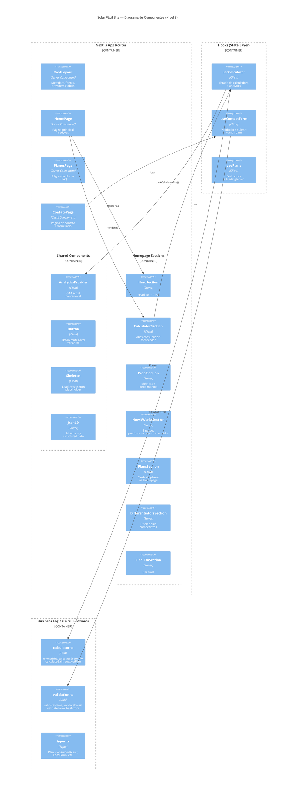

# C4 Components — Solar Fácil Site

> Nível 3: Árvore de componentes React, hooks providers, fluxo de dados entre componentes.
> Gerado por `architecture-designer` em 2026-07-08.

---

## Diagrama de Componentes (Mermaid)



## Descrição dos Componentes

### Páginas (Rotas)

| Componente | Arquivo | Tipo | Descrição |
|---|---|---|---|
| **RootLayout** | `layout.tsx` | Server | Metadata global, Inter font, AnalyticsProvider, Header, Footer |
| **HomePage** | `page.tsx` | Server | Homepage com Hero, Calculadora, Prova, ComoFunciona, Planos, Diferenciais, CtaFinal |
| **PlanosPage** | `planos/page.tsx` | Server | PlanosComparisonTable, ProviderHighlight, FaqAccordion |
| **ContatoPage** | `contato/page.tsx` | Client | ContactForm, DirectChannels, JourneySummary |

### Componentes Compartilhados

| Componente | Tipo | Props |
|---|---|---|
| **Button** | Client | `variant: 'primary' \| 'secondary' \| 'outline'`, `href?`, `onClick?`, `disabled?`, `children` |
| **Skeleton** | Client | Componente sem props — placeholder puro |
| **SectionWrapper** | Server | `id?: string`, `background?: 'white' \| 'yellow'`, `children` |
| **MetricCard** | Server | `value: string`, `label: string`, `icon?: string` |
| **Breadcrumb** | Server | `items: { label: string; href: string }[]` |
| **JsonLd** | Server | Schema.org JSON-LD para SEO |
| **AnalyticsProvider** | Client | Carrega script GA4 se `NEXT_PUBLIC_GA_ID` definido |

### Seções da Homepage

| Seção | Tipo | Hook/Service |
|---|---|---|
| **HeroSection** | Server | — (conteúdo estático) |
| **CalculatorSection** | Server | — (wrapper, estado nos filhos) |
| **ConsumerCalculator** | Client | `useCalculator('consumer')` |
| **ProviderCalculator** | Client | `useCalculator('provider')` |
| **ProofSection** | Server | `METRICS` constant |
| **HowItWorksSection** | Server | `HOW_IT_WORKS_STEPS` constant |
| **PlansSection** | Client | `usePlans()` |
| **DifferentiatorsSection** | Server | `DIFFERENTIATORS` constant |
| **FinalCtaSection** | Server | — (CTAs estáticos) |

### Hooks (State Layer)

| Hook | Responsabilidade | Dependências |
|---|---|---|
| `useCalculator` | Estado da calculadora (input, result, error, hasCalculated) | `calculator.ts`, `analytics.ts` |
| `useContactForm` | Estado do formulário (values, errors, isSubmitting, isSuccess) | `validation.ts`, `fetch` |
| `usePlans` | Fetch de planos (loading, error, plans[]) | `servicePlans.ts` |
| `useFAQs` | Fetch de FAQs | `serviceFAQs.ts` |
| `useConcessionarias` | Fetch de concessionárias | `serviceConcessionarias.ts` |
| `useConsumoMedio` | Fetch de consumo médio | `serviceConsumoMedio.ts` |
| `useFaqAccordion` | Estado de accordion (índice aberto) | — |

## Fluxo de Dados entre Componentes

### Fluxo da Calculadora

```
ConsumerCalculator (UI)
  └→ useCalculator('consumer') hook
       ├→ useState: input, result, error, hasCalculated
       ├→ calculate():
       │    ├→ calculateConsumerEconomy(input) → ConsumerResult
       │    └→ trackCalculatorUse({persona, input_value, result})
       └→ reset()
```

### Fluxo do Formulário

```
ContactForm (UI)
  └→ useContactForm({initialProfile, initialMessage})
       ├→ useState: values, errors, isSubmitting, isSuccess
       ├→ setField(field, value) → validação inline
       ├→ handleSubmit():
       │    ├→ validateForm(values) → FormErrors
       │    ├→ Anti-spam: elapsed < 3s → fake success
       │    └→ fetch(FORM_ENDPOINT, {method: 'POST', body: FormData})
       └→ SuccessScreen | submitError
```

---

Última atualização: 2026-07-08
