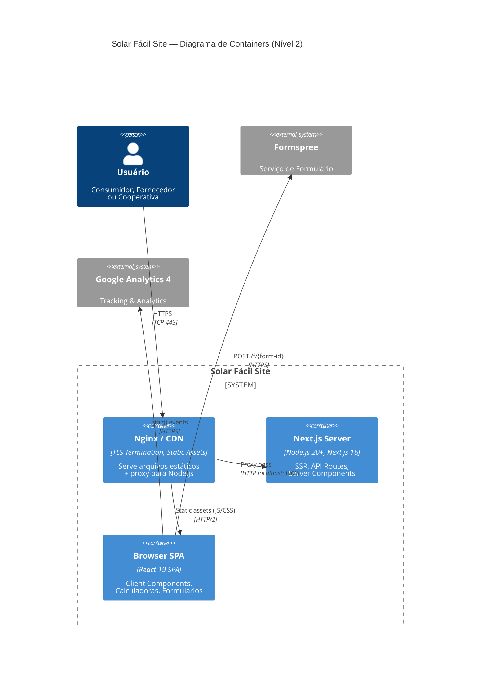

# C4 Containers — Solar Fácil Site

> Nível 2: Containers de deploy — aplicação web, servidor Node.js, CDN, sistemas externos.
> Gerado por `architecture-designer` em 2026-07-08.

---

## Diagrama de Containers (Mermaid)



## Descrição dos Containers

### Nginx / CDN

| Propriedade | Valor |
|---|---|
| **Tipo** | Reverse Proxy + CDN |
| **Responsabilidade** | TLS termination, servir assets estáticos, proxy para Node.js |
| **Tecnologia** | Nginx (ou CDN do provedor de hospedagem) |
| **Portas** | TCP 443 (HTTPS) → proxy para `localhost:3000` |
| **Escalabilidade** | Horizontal (múltiplas instâncias atrás de load balancer) |

### Next.js Server (Node.js)

| Propriedade | Valor |
|---|---|
| **Tipo** | Servidor de Aplicação Node.js |
| **Responsabilidade** | Server-Side Rendering (SSR), Server Components, geração de sitemap/robots |
| **Tecnologia** | Node.js 20+, Next.js 16.2.10 (output: standalone) |
| **Build** | `next build` → `.next/standalone/` |
| **Start** | `node server.js` (incluído no bundle standalone) |
| **Porta** | 3000 (interna, atrás do Nginx) |

### Browser SPA (React 19)

| Propriedade | Valor |
|---|---|
| **Tipo** | Single Page Application (hidratada de SSR) |
| **Responsabilidade** | Interatividade client-side: calculadoras, formulários, analytics |
| **Tecnologia** | React 19.2.4 + TypeScript 5 + Tailwind CSS v4 |
| **Carregamento** | HTML inicial via SSR → hidratação React → interatividade |
| **Estado** | Local apenas (`useState`/`useCallback`), sem store global |

## Fluxo de uma Requisição Típica

```
1. Usuário → HTTPS → Nginx (TLS termination)
2. Nginx → proxy_pass → Node.js:3000
3. Node.js processa:
   a. Server Component: renderiza no servidor, envia HTML
   b. Client Component: envia JS bundle para hidratação
4. Nginx ← HTML + headers ← Node.js
5. Usuário ← HTML + JS + CSS ← Nginx (HTTP/2)
6. Browser hidrata React → componentes interativos
7. Browser → Formspree (formulário) / GA4 (analytics)
```

---

Última atualização: 2026-07-08
