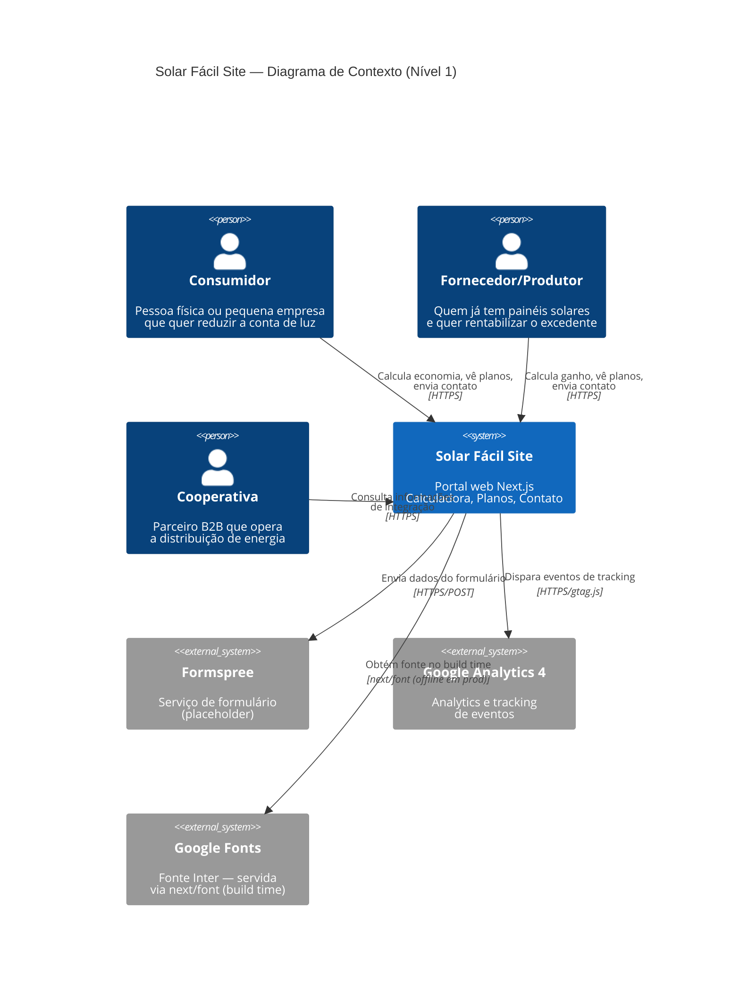

# C4 Context — Solar Fácil Site

> Nível 1: O sistema no ecossistema — atores (usuários) e sistemas externos.
> Gerado por `architecture-designer` em 2026-07-08.

---

## Diagrama de Contexto (Mermaid)

## Descrição dos Elementos

### Atores

| Ator | Descrição | Necessidade Principal |
|---|---|---|
| **Consumidor** | Pessoa física ou pequena empresa. Acessa principalmente via mobile, durante horário comercial. Não é especialista em energia. | "Quanto vou economizar sem instalar nada?" |
| **Fornecedor/Produtor** | Já tem painéis solares instalados. Perfil mais técnico. Quer rentabilizar excedente. | "Quanto posso ganhar compartilhando meu excedente?" |
| **Cooperativa** | Parceiro B2B. Opera a distribuição regulamentada pela ANEEL. | "Como integrar com a plataforma?" |

### Sistemas Externos

| Sistema | Tipo | Status | Integração |
|---|---|---|---|
| **Formspree** | Serviço de formulário HTTPS | ⚠️ Placeholder | POST multipart/form-data |
| **Google Analytics 4** | Analytics client-side | ✅ Condicional (env var) | `window.gtag()` |
| **Google Fonts** | CDN de fontes | ✅ Build time | `next/font/google` (self-hosted em prod) |

### Fluxos de Dados Principais

1. **Consumidor → Site**: Navegação, input na calculadora, submissão de formulário
2. **Fornecedor → Site**: Navegação, input na calculadora (modo fornecedor), submissão de formulário
3. **Site → Formspree**: POST com FormData (nome, email, telefone, perfil, mensagem)
4. **Site → GA4**: Eventos `cta_click`, `calculator_use`, `faq_open`, `lead_capture`

---

Última atualização: 2026-07-08
