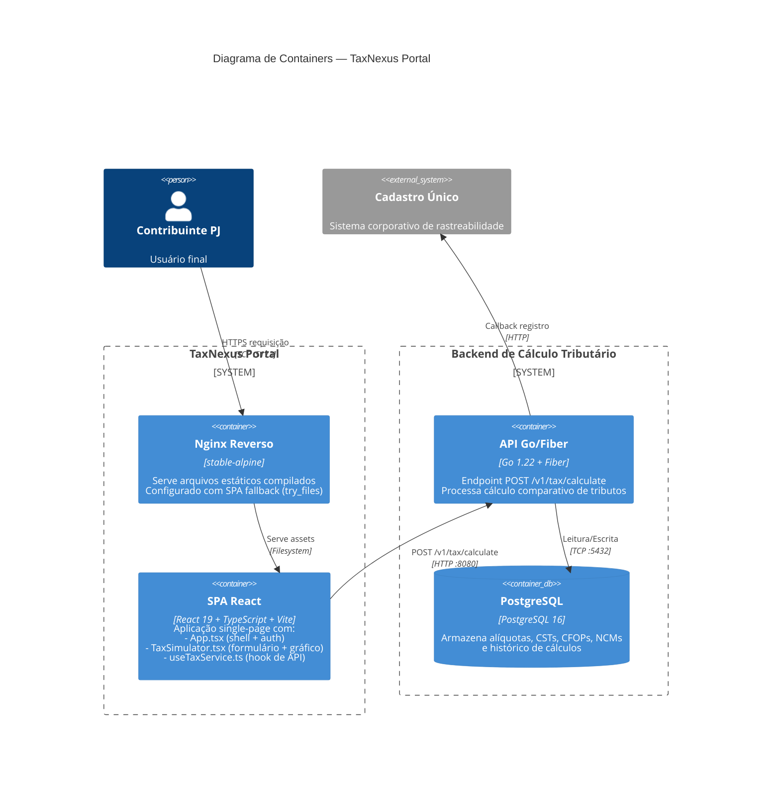

# C4 — Nível 2: Containers

## Diagrama

## Elementos

| Nome | Tipo | Responsabilidade | Tecnologia |
|---|---|---|---|
| Nginx Reverso | Container (Web Server) | Servir bundle estático React com SPA fallback | Nginx stable-alpine |
| SPA React | Container (Frontend) | Interface de simulação tributária | React 19 + TS 5.9 + Vite 8 |
| API Go/Fiber | Container (Backend) | Cálculo de tributos comparativos | Go 1.22 + Fiber |
| PostgreSQL | Container (Database) | Persistência de alíquotas e histórico | PostgreSQL 16 |
| Cadastro Único | External System | Rastreabilidade corporativa | — |

## Fluxos Principais

### Fluxo: Carregamento Inicial
1. Navegador requisita `GET /` ao Nginx
2. Nginx serve `index.html` (SPA shell)
3. Navegador carrega bundle React (JS/CSS)
4. React hydrata e renderiza tela de login (CNPJ)

### Fluxo: Simulação
1. Usuário preenche formulário e clica "SIMULAR REFORMA TRIBUTÁRIA"
2. `useTaxService.calculateTax()` dispara `POST http://localhost:8080/v1/tax/calculate`
3. API Go processa no backend e consulta PostgreSQL para alíquotas
4. Resposta retorna ao frontend
5. `TaxSimulator` renderiza cards e gráfico Recharts

### Deploy
1. `docker build` executa multi-stage: Node 18 alpine (build) → Nginx stable-alpine (runtime)
2. Container expõe porta 5173
3. Nginx configurado com `try_files $uri /index.html` para client-side routing
