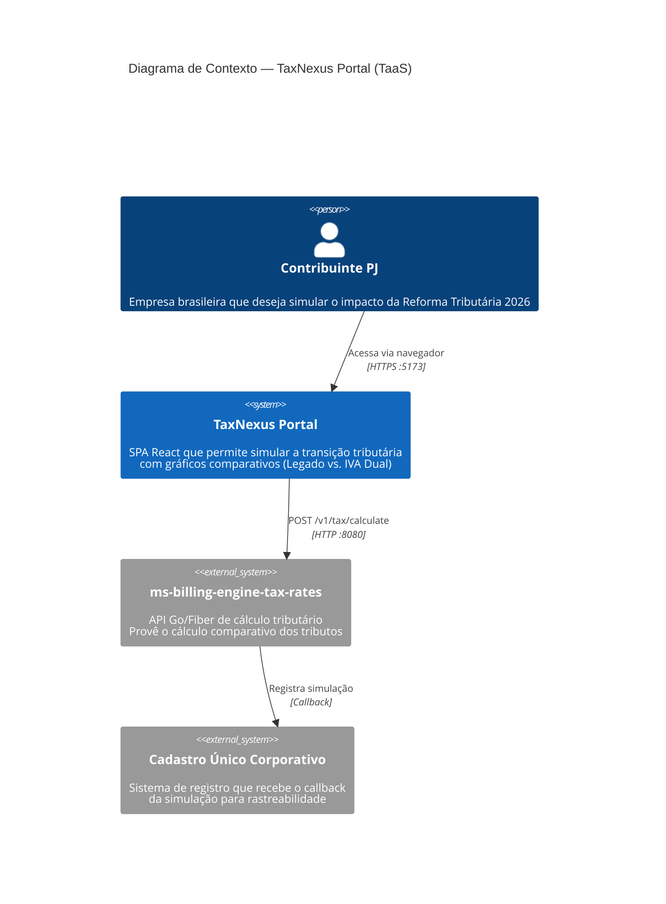

# C4 — Nível 1: Contexto do Sistema

## Diagrama

## Elementos

| Nome | Tipo | Responsabilidade | Tecnologia |
|---|---|---|---|
| Contribuinte PJ | Person (Ator) | Usuário final — informa CNPJ, NCM, UF/Cidade e saldo para simular | Navegador web |
| TaxNexus Portal | System | Interface de simulação tributária com formulário e gráficos comparativos | React 19 + TypeScript + Vite + Recharts |
| ms-billing-engine-tax-rates | External System | API de cálculo tributário — computa PIS/COFINS/ICMS/ISS/IPI (legado) vs. CBS/IBS/IS (reforma) | Go 1.22 + Fiber |
| Cadastro Único Corporativo | External System | Recebe callback com ID de cadastro único para rastreabilidade da simulação | Desconhecido |

## Fluxos Principais

### Fluxo 1: Simulação Tributária Completa
1. Contribuinte acessa o portal via navegador e informa CNPJ (14 dígitos)
2. Portal valida CNPJ localmente e libera acesso ao simulador
3. Contribuinte seleciona UF, Cidade (IBGE), NCM e Saldo Remanescente
4. Portal envia requisição `POST /v1/tax/calculate` ao backend Go
5. Backend processa cálculo e retorna tributos legados + reforma + callback
6. Portal exibe resultados em cards comparativos e gráfico de barras (2026 vs. 2027)
7. Backend notifica Cadastro Único Corporativo com ID de rastreio

### Fluxo 2: Tratamento de Erro
1. Se a API backend estiver indisponível ou retornar erro
2. Portal registra erro no console e retorna `null`
3. UI permanece no estado atual sem crash (graceful degradation)
