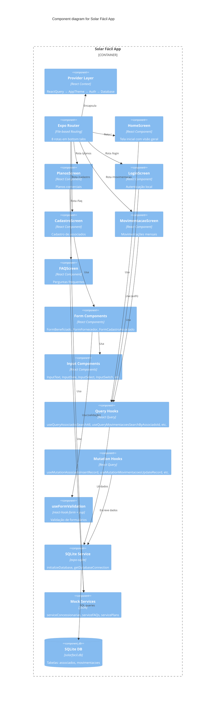

# C4 — Nível 3: Componentes

## Diagrama de Componentes



## Árvore de Componentes Principal

```
App (Expo Router)
├── ReactQueryProvider
│   └── AppThemeProvider
│       └── AuthProvider
│           └── SafeAreaProvider
│               └── DatabaseProvider
│                   └── GestureHandlerRootView
│                       └── Tabs (8 rotas)
│                           ├── index (HomeScreen)
│                           ├── planos (PlanosScreen)
│                           ├── saibamais (SaibaMaisScreen)
│                           ├── faq (FAQScreen)
│                           ├── login (AssociadoLoginScreen)
│                           ├── cadastro (AssociadoCadastroScreen)
│                           ├── movimentacao (MovimentacaoComCardScreen)
│                           └── listatodos (AssociadoListaTodosScreen)
```

## Fluxos de Dados por Tela

### HomeScreen
```
HomeScreen → useQueryAssociadosSearchAll → SQLite → Exibe cards de associados
```

### Login
```
LoginScreen → Formulário (CPF/CNPJ + Senha)
  → useQueryAssociadosSearchByCpfCnpjSenha → SQLite
  → AuthContext.login() → Redireciona para Home
```

### Cadastro
```
CadastroScreen → FormCadastroAssociado
  → Inputs (InputText, InputSelect, InputDate, etc.)
  → useFormValidation (yup schema)
  → useMutationAssociadoInsertRecord → SQLite
```

### Movimentações
```
MovimentacaoScreen → useQueryMovimentacoesSearchByAssociadoId → SQLite
  → Victory Chart (gráfico de economia)
  → Cards de movimentação (valores, status)
```

### Planos
```
PlanosScreen → servicePlans (mock JSON) → CardPlan (exibe planos comerciais)
```
