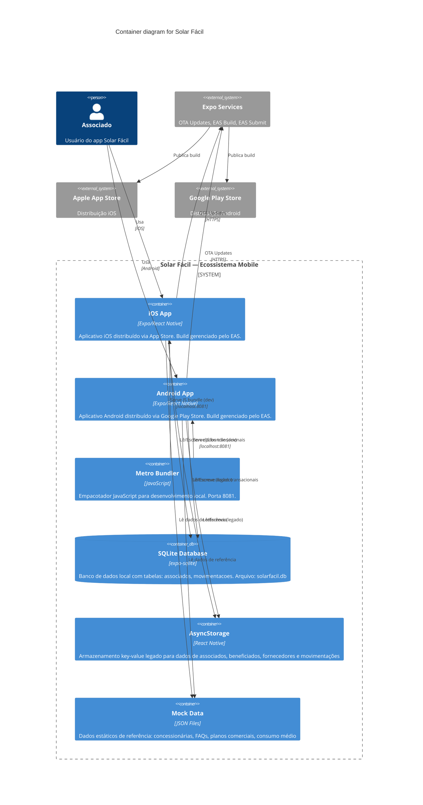

# C4 — Nível 2: Containers

## Diagrama de Containers



## Descrição dos Containers

| Container | Tecnologia | Responsabilidade |
|---|---|---|
| **iOS App** | Expo/React Native (Swift bridge) | Aplicativo nativo iOS com New Architecture habilitada |
| **Android App** | Expo/React Native (Kotlin bridge) | Aplicativo nativo Android com edge-to-edge e New Architecture |
| **Metro Bundler** | JavaScript (Node.js) | Desenvolvimento local — hot reload, HMR na porta 8081 |
| **SQLite Database** | expo-sqlite (~15.2.13) | Fonte primária de dados — tabelas `associados` e `movimentacoes` |
| **AsyncStorage** | @react-native-async-storage (2.1.2) | Armazenamento key-value (legado em migração para SQLite) |
| **Mock Data** | JSON estático | Dados de referência (concessionárias, FAQs, planos) |

## Comunicação entre Containers

### Desenvolvimento Local

```
Metro Bundler :8081 ──JS Bundle──► iOS Simulator / Android Emulator
                                  │
                                  ├── SQLite (local)
                                  ├── AsyncStorage (local)
                                  └── Mock Data (JSON local)
```

### Produção

```
iOS/Android App (JS bundle empacotado)
  ├── SQLite (local)
  ├── AsyncStorage (local)
  └── Mock Data (JSON local)

Expo Updates (expo.dev) ──OTA──► App (atualiza JS bundle sem nova build)
```
