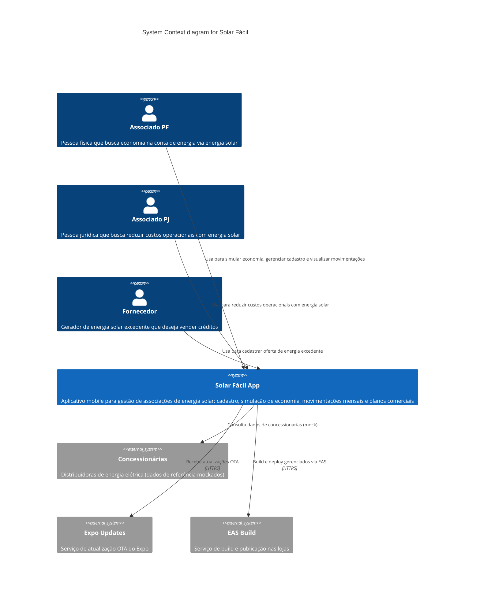

# C4 — Nível 1: Contexto do Sistema

## Diagrama de Contexto



## Descrição dos Elementos

### Pessoas (Actors)

| Ator | Descrição | Necessidades |
|---|---|---|
| **Associado PF** | Pessoa física, consumidora de energia | Cadastrar-se, simular economia com energia solar, visualizar movimentações mensais |
| **Associado PJ** | Pessoa jurídica, potencialmente consumidora e fornecedora | Gerenciar múltiplas unidades, analisar economia em escala |
| **Fornecedor** | Gerador de energia solar excedente | Cadastrar sistema de geração, disponibilizar créditos de energia |

### Sistemas Externos

| Sistema | Descrição | Tipo de Integração |
|---|---|---|
| **Concessionárias** | Dados de referência de distribuidoras de energia (mockados localmente) | JSON estático local |
| **Expo Updates** | Serviço de atualização over-the-air do Expo | HTTPS (expo.dev) |
| **EAS Build** | Serviço de build e publicação do Expo | HTTPS (expo.dev) |

## Fluxos de Dados Principais

### Fluxo 1: Cadastro de Associado
```
Associado → App → Formulário (react-hook-form + yup) → useMutationAssociadoInsertRecord → SQLite
```

### Fluxo 2: Login
```
Associado → App → CPF/CNPJ + Senha → useQueryAssociadosSearchByCpfCnpjSenha → SQLite → AuthContext
```

### Fluxo 3: Visualização de Movimentações
```
Associado → App → Tela de Movimentações → useQueryMovimentacoesSearchByAssociadoId → SQLite → Gráfico (Victory)
```
