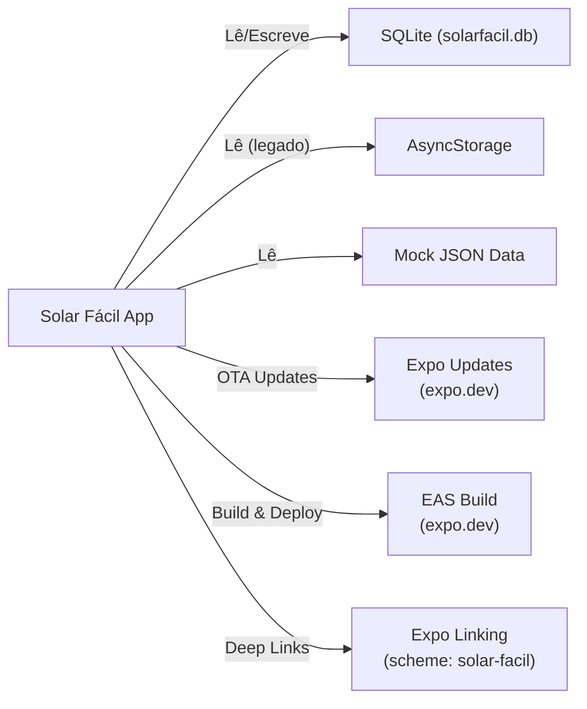

# Integrações Externas — Solar Fácil

## 1. Visão Geral

O Solar Fácil é uma aplicação **offline-first** com dependências externas mínimas. As integrações são limitadas a serviços do ecossistema Expo e dados locais mockados.

## 2. Diagrama de Integrações

## 3. Tabela de Dependências

### 3.1. Dependências de Produção (npm)

| Pacote | Versão | Propósito | Criticalidade |
|---|---|---|---|
| expo | ~53.0.9 | Plataforma Expo | Crítica |
| react-native | 0.79.3 | Framework mobile | Crítica |
| expo-router | ~5.0.6 | Navegação | Crítica |
| expo-sqlite | ~15.2.13 | Banco de dados | Crítica |
| nativewind | ^4.0.1 | Estilização | Alta |
| tailwindcss | ^3.4.17 | CSS utilitário | Alta |
| react-hook-form | ^7.56.4 | Formulários | Alta |
| yup | ^1.6.1 | Validação | Alta |
| @tanstack/react-query | ^5.83.0 | Cache/Estado assíncrono | Alta |
| react-native-reanimated | ~3.17.4 | Animações | Média |
| moti | ^0.30.0 | Animações declarativas | Média |
| axios | ^1.9.0 | HTTP client | Média |
| victory-native | ^41.17.3 | Gráficos | Média |
| expo-image | ~2.2.0 | Imagens otimizadas | Baixa |
| expo-image-picker | ~16.1.4 | Seleção de imagens | Baixa |
| expo-haptics | ~14.1.4 | Feedback tátil | Baixa |
| expo-updates | ~0.28.17 | OTA updates | Baixa |
| expo-linking | ~7.1.5 | Deep links | Baixa |

### 3.2. Serviços Externos

| Serviço | URL | Propósito | Auth |
|---|---|---|---|
| Expo Updates | `https://u.expo.dev/eaf32393-0c03-4e40-9005-fd5955794e5a` | OTA JavaScript updates | Expo token |
| EAS Build | `https://expo.dev` | Build & submit | Expo account (`bolismar69`) |

## 4. Contratos de Dados Locais

### 4.1. SQLite — Tabela `associados`

Descrito em `api/solar-facil-api.yaml` → `#/components/schemas/Associado`

### 4.2. SQLite — Tabela `movimentacoes`

Descrito em `api/solar-facil-api.yaml` → `#/components/schemas/MovimentacaoMensal`

### 4.3. Mock Data — JSON Files

| Arquivo | Formato | Schema |
|---|---|---|
| `mockConcessionarias.json` | `ConcessionariaType[]` | id, nome, regiao, estado |
| `mockConsumoMedio.json` | `ConsumoMedioType[]` | faixa, valor |
| `mockFAQs.json` | `FAQType[]` | id, pergunta, resposta |
| `mockPlans.json` | `PlanType[]` | id, nome, descricao, economiaEstimada |

## 5. Políticas de Retry e Timeout

### 5.1. Acesso a Dados Locais

| Operação | Timeout | Retry |
|---|---|---|
| SQLite Read | N/A (síncrono/async local) | 0 (erro imediato) |
| SQLite Write | N/A (transação local) | 0 (erro imediato) |

### 5.2. Serviços Remotos (Futuro)

| Serviço | Timeout | Retry | Backoff |
|---|---|---|---|
| API Backend | [TODO] 10s | 3 | Exponential (1s, 2s, 4s) |
| Expo Updates | Gerenciado pelo Expo | — | — |

## 6. Estratégia de Cache

| Camada | Estratégia | Configuração |
|---|---|---|
| React Query | stale-while-revalidate | [TODO] Definir `staleTime` por query |
| SQLite | Persistência local | Dados permanentes até delete explícito |
| Mock JSON | Estático | Carregado uma vez (import) |

## 7. Monitoramento de Saúde

[TODO]:
- Health check de conexão SQLite: `initializeDatabase()` retorna estado
- Health check de OTA updates: `expo-updates` API
- Logging centralizado: atualmente apenas `console.log` — implementar sistema de logging estruturado
