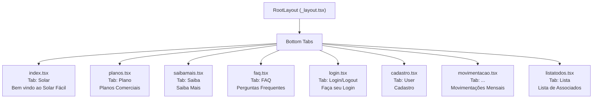

# Arquitetura de Navegação — Solar Fácil

## 1. Árvore de Navegação



## 2. Stack de Navegação

| Biblioteca | Versão | Papel |
|---|---|---|
| expo-router | ~5.0.6 | File-based router principal |
| @react-navigation/native | ^7.1.10 | Container de navegação |
| @react-navigation/bottom-tabs | ^7.3.14 | Bottom tab navigator |
| @react-navigation/native-stack | ^7.3.14 | Stack navigator para push/pop |
| react-native-screens | ~4.11.1 | Screens nativas otimizadas |
| react-native-safe-area-context | 5.4.0 | Safe area insets |
| expo-linking | ~7.1.5 | Deep link handling |

## 3. Tabela de Rotas

| Rota | Arquivo | Tab Label | Título | Header | Auth Required |
|---|---|---|---|---|---|
| `/` | `index.tsx` | Solar | Bem vindo ao Solar Fácil | Sim | Não |
| `/planos` | `planos.tsx` | Plano | Planos Comerciais | Sim | Não |
| `/saibamais` | `saibamais.tsx` | Saiba | Saiba Mais | Sim | Não |
| `/faq` | `faq.tsx` | FAQ | Perguntas Frequentes | Sim | Não |
| `/login` | `login.tsx` | Login/Logout | Faça seu Login | Sim | Não |
| `/cadastro` | `cadastro.tsx` | User | Cadastro | Não | Não |
| `/movimentacao` | `movimentacao.tsx` | ... | Movimentações Mensais | Sim | Sim (implícito) |
| `/listatodos` | `listatodos.tsx` | Lista | Lista | Sim | Sim (implícito) |

## 4. Parâmetros de Rota

### Expo Router — Typed Routes

```typescript
// app.json: "experiments": { "typedRoutes": true }

// Navegação type-safe
type Routes = {
  "/": undefined;
  "/planos": undefined;
  "/saibamais": undefined;
  "/faq": undefined;
  "/login": undefined;
  "/cadastro": { associadoId?: number };  // Edição de cadastro existente
  "/movimentacao": { associadoId: number };
  "/listatodos": undefined;
};
```

## 5. Deep Links

### 5.1. Scheme

```
solar-facil://
```

### 5.2. Configuração (app.json)

```json
{
  "scheme": "solar-facil"
}
```

### 5.3. Deep Links Definidos

| URL | Rota | Propósito |
|---|---|---|
| `solar-facil://` | `/` | Home |
| `solar-facil://planos` | `/planos` | Planos comerciais |
| `solar-facil://faq` | `/faq` | FAQ |
| `solar-facil://login` | `/login` | Login |
| `solar-facil://cadastro` | `/cadastro` | Cadastro |
| `solar-facil://movimentacao?id={id}` | `/movimentacao?associadoId={id}` | Movimentações |

## 6. Fluxos de Navegação

### 6.1. Fluxo: Novo Usuário

```
App Aberto → Splash Screen → Home (pública)
  → Tab "Saiba" → Conteúdo institucional
  → Tab "FAQ" → Dúvidas
  → Tab "Plano" → Planos comerciais
  → Tab "User" → Cadastro → Sucesso → Tab "Login"
```

### 6.2. Fluxo: Login

```
Tab "Login" → Preenche CPF/CNPJ + Senha
  → Validação (useQueryAssociadosSearchByCpfCnpjSenha)
  → AuthContext.login() → Tab muda nome para "Logout"
  → Acesso a "Movimentações" e "Lista"
```

### 6.3. Fluxo: Logout

```
Tab "Logout" → AuthContext.logout()
  → Estado limpo → Tab volta a mostrar "Login"
```

## 7. Autenticação Condicional

A tab "Login" adapta seu comportamento baseado no estado `isLoggedIn`:

```typescript
// _layout.tsx — AuthProtectedSlot
const { isLoggedIn } = useAuth();

// Tab label dinâmico
tabBarLabel: isLoggedIn === true ? "Logout" : "Login"

// Ícone dinâmico
tabBarIcon: isLoggedIn === true ? "flash-off-outline" : "flash-outline"
```

Telas como `movimentacao` e `listatodos` são acessíveis apenas com dados de um associado logado — renderizam conteúdo condicional baseado no `AuthContext`.

## 8. Observações

- **Navegação é exclusivamente por tabs**: não há stacks aninhadas ou modals no momento.
- **Header condicional**: a tela de cadastro tem `headerShown: false`.
- **Typed Routes**: habilitado via `experiments.typedRoutes: true` — todas as rotas são type-safe.
- [TODO]: Implementar guarda de rota para telas que exigem autenticação (redirecionar para login).
- [TODO]: Adicionar deep links para compartilhamento de planos.
